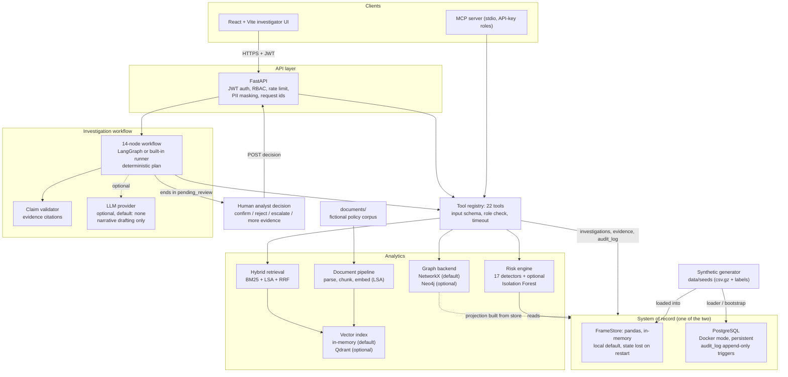
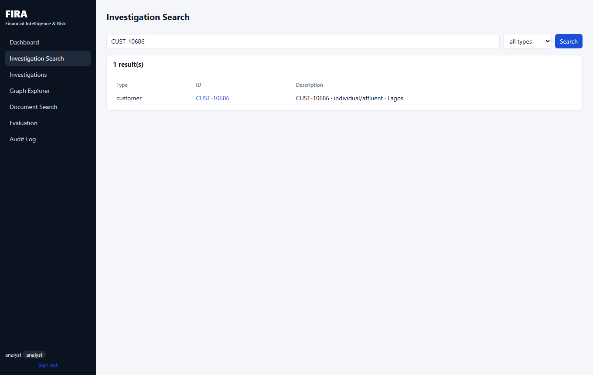
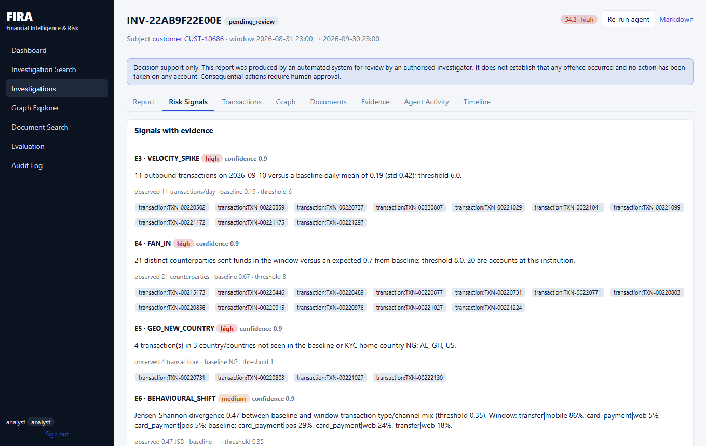
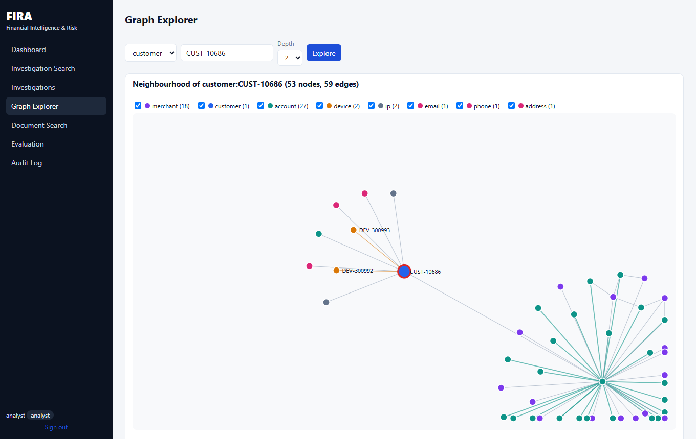
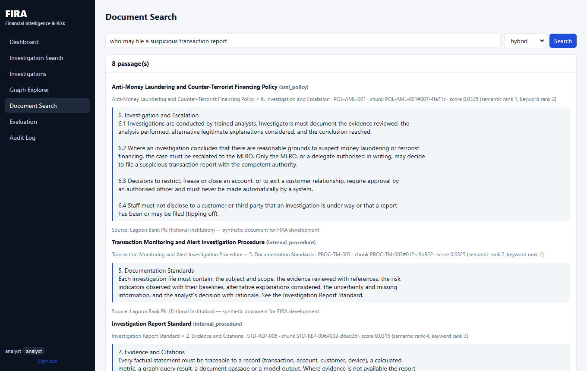
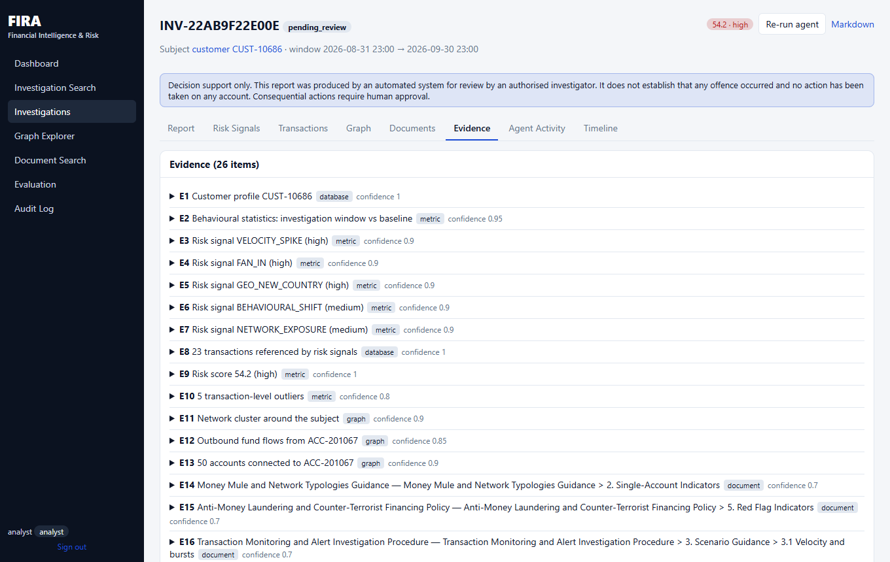

# FIRA — Financial Intelligence & Risk

FIRA is a **prototype** of a decision-support tool for financial-crime investigators, built as a
portfolio project on **entirely synthetic data**. Given a customer, account, transaction or device it
collects evidence, computes deterministic and explainable risk signals, analyses the relationship
graph, retrieves relevant policy passages, recalls earlier cases, and drafts an investigation report.
Every claim in the report cites stored evidence, and a human analyst then records a decision.

It models the workflow of a bank's financial-crime investigations team (transaction-monitoring
follow-up, mule and device-ring analysis). It is **not** a production AML or fraud system, has not
been validated on real data, and its metrics must not be read as real-world detection performance.

> **Decision boundary.** FIRA never freezes, closes or blocks accounts, never denies credit, never
> files regulatory reports and never states that anyone committed a crime. The agent's final step
> puts the investigation in `pending_review` for a human.

> **Alerts: read this first.** The alerts you see in the UI and in the `alerts` table are **seeded
> synthetic legacy-rule alerts** that ship with the dataset so investigations have a starting queue.
> **Automated creation of alerts from FIRA risk scores is not currently implemented.** FIRA's risk
> engine scores investigation subjects on demand (API or agent) and does not write alerts.

## Contents

[Key capabilities](#key-capabilities) · [Architecture](#architecture) · [Technology stack](#technology-stack) ·
[Data](#data) · [Risk engine](#risk-engine) · [Investigation workflow](#investigation-workflow) ·
[AI / LLM](#ai--llm) · [Alerts](#alerts) · [Evaluation](#evaluation) · [Installation](#installation) ·
[Testing](#testing) · [Demo](#demo) · [Screenshots](#screenshots) · [Security](#security) ·
[Limitations](#limitations) · [Roadmap](#roadmap) · [License](#license)

## Key capabilities

- **Risk analysis:** 17 deterministic detectors (burst, velocity, amount deviation, rapid
  pass-through, fan-in, impossible travel, device sharing, circular flow, dormant reactivation and
  others) plus an optional Isolation-Forest anomaly signal. Scores are transparent: weight × strength,
  group caps, YAML configuration.
- **Investigation workflow:** a 14-node stateful workflow that gathers evidence through 22
  permissioned tools and ends in `pending_review`.
- **Graph intelligence:** account, device, merchant and identifier relationships; clusters, shared
  devices, fund tracing, paths, cycles and centrality (NetworkX by default, optional Neo4j).
- **Document retrieval:** parsing for Markdown, PDF (including OCR for scanned pages) and DOCX,
  section-aware chunking, and hybrid retrieval (BM25 keyword + LSA semantic, fused with reciprocal
  rank fusion) with provenance.
- **Evidence grounding:** every claim cites evidence (`E1`, `E2`, …); a validator checks that cited
  evidence exists and that numbers, dates and ids match it.
- **Human review:** analysts confirm, reject, escalate or request more evidence; decisions feed a
  failure-analysis and controlled configuration-improvement loop (proposal → offline regression →
  four-eyes approval).
- **Audit logging:** logins, tool calls, agent runs and decisions are recorded with request ids. In
  PostgreSQL mode the table is protected from update/delete by database triggers.
- **RBAC and privacy:** JWT authentication, `analyst` / `admin` roles, PII masking at the API
  boundary, rate limiting. See [Security](#security) for what is *not* implemented.
- **Interfaces:** FastAPI REST API (OpenAPI at `/docs`), a React + TypeScript investigator UI, and an
  MCP server.

## Architecture



*Solid arrows are the default local path; "optional" components are off by default. FrameStore and
PostgreSQL are alternatives (`DATA_BACKEND=frames|postgres`), not used together. The diagram is
derived from `backend/app` (see [docs/ARCHITECTURE.md](docs/ARCHITECTURE.md) for the detailed data
flow).*

## Technology stack

| Area | Technology |
|---|---|
| Backend | Python 3.11+ (CI on 3.12), FastAPI, Pydantic v2, Uvicorn |
| Database | PostgreSQL 15+ (schema in `backend/app/db/schema.sql`, Alembic migrations 0001–0002, optional PostGIS layer); pandas-based in-memory `FrameStore` for local use |
| Risk | Deterministic detectors in `backend/app/risk`, YAML configuration, scikit-learn Isolation Forest (optional) |
| Graph | NetworkX (default); Neo4j 5 backend (optional) |
| Retrieval | LSA embeddings (scikit-learn), BM25 / PostgreSQL full-text, reciprocal rank fusion; in-memory vector index or Qdrant (optional) |
| Agent workflow | LangGraph (a built-in runner with identical semantics is used if LangGraph is absent); optional LLM providers over plain HTTP (Anthropic, OpenAI, Ollama) |
| Frontend | React 19, TypeScript, Vite |
| Testing | pytest + pytest-cov, ruff, mypy, bandit; `tsc` and a Vite build for the frontend (there are no frontend unit tests) |
| Deployment | Docker Compose (PostgreSQL/PostGIS, Neo4j, Qdrant, backend, nginx frontend); GitHub Actions workflow |

## Data

All data is **synthetic** and produced by `backend/app/synthetic/generator.py`; nothing comes from a
real institution or customer.

| | Default dataset (`--customers 10000 --seed 42`) |
|---|---|
| Customers / accounts | 10,000 / 15,667 |
| Transactions | 254,197 |
| Merchants / devices | 2,000 / 14,003 |
| Injected scenarios | 11 (mule account, device-sharing ring, circular transfer, account takeover, burst, geographic anomaly, dormant reactivation, high-risk merchant, plus legitimate look-alikes) with ground-truth labels |
| Seeded legacy alerts | 515 in total: 265 open and 250 historical closed; randomly generated "legacy rule" noise, independent of the ground truth |
| Seeded historical investigations | 200 closed, randomly generated conclusions |
| Source documents | 12 registered: 11 files in `documents/` (Markdown, PDF, scanned PDF, DOCX; a fictional institution, "Lagoon Bank Plc") plus one generated "historical case notes" document built from the seeded investigations |
| Indexed chunks | 272 in the verified run (the unit the vector index and the dashboard's "indexed chunks" count). This was measured **without** the Tesseract OCR binary installed, so the scanned PDF memo yielded no chunks and the ingest report lists a warning for it. With Tesseract installed (the Docker image installs it) the count is higher |

The generator and the detectors were designed together. See [Evaluation](#evaluation).

## Risk engine

For one customer and a lookback window (default 30 days against a 90-day baseline) the engine
computes window and baseline statistics identically, runs each detector, and turns every detector
that crosses its threshold into a signal with the observed value, baseline, threshold and the
transaction ids behind it. Points are `weight × strength`, where strength is 0.5 at the threshold and
rises linearly to 1.0. Correlated signals share a group cap, and the total is capped at 100.
Thresholds and weights live in [`default_config.yaml`](backend/app/risk/default_config.yaml) and are
**engineering defaults, not regulatory values and not calibrated on real data.** No LLM is involved.
Details: [docs/RISK_ENGINE.md](docs/RISK_ENGINE.md).

## Investigation workflow

```
signal → evidence → graph → documents → investigation → human review
```

1. A request such as "Investigate CUST-10686 over the last 30 days" is parsed for the subject.
2. A fixed plan runs tools: profile, transactions, window-vs-baseline statistics, risk signals,
   graph cluster / shared devices / fund tracing, policy retrieval per fired signal, and previous
   cases.
3. Evidence fusion stores each tool output as a numbered evidence item.
4. The report is assembled; claims are validated; the investigation becomes `pending_review`.
5. An analyst records a decision, which is stored with the investigation and the agent run.

## AI / LLM

- **LangGraph is used for workflow orchestration.** The workflow is a fixed graph of 14 nodes; the
  tool plan is chosen deterministically per investigation type.
- **The default workflow is deterministic.** With the default `LLM_PROVIDER=none`, no model is called
  and report narratives are rendered from evidence by code (`narrative_source: deterministic`,
  0 tokens).
- **LLM integration is optional.** Provider code for Anthropic, OpenAI and Ollama exists, but it has
  only been exercised with scripted test providers. It has **not** been called against a live model.
- **When enabled, the LLM only drafts narrative text** from an already-collected, masked evidence
  pack. It does not choose tools, change scores or take actions.
- **Claims are validated.** A claim must cite existing evidence; numbers, dates and entity ids must
  match the cited evidence; accusatory language and unattended action directives are rejected; one
  retry, then a deterministic fallback. The validator is rule-based, so it checks grounding, not
  reasoning quality.
- **Final decisions remain with human review.** No AI output changes an investigation's conclusion.
- FIRA has **not** been validated as a production AI or AML system.

## Alerts

Current alerts are seeded synthetic/legacy alerts used to support investigation workflows.
Automated creation of alerts from FIRA risk scores is not currently implemented.

- *Seeded legacy alerts* (table `alerts`, shown on the dashboard) are loaded with the dataset. A
  subset are attached to suspicious customers and many are noise, so the first open alert may score
  0 in FIRA's own assessment.
- *FIRA risk assessment* (`GET /api/risk/{entity_type}/{entity_id}`, the agent) independently
  evaluates a subject with the configurable detectors. Results are stored inside investigations, not
  as alerts.

## Evaluation

The benchmark scores the engine against the generator's ground-truth labels. Committed result files
are in [`evaluation/results/`](evaluation/results).

| | dev (seed 42, 10k customers) | holdout (seed 7, 5k customers) |
|---|---|---|
| Risk precision / recall / F1 | 0.991 / 0.890 / 0.938 | 0.991 / 0.912 / 0.950 |
| False-positive rate (labelled legitimate) | 0.005 | 0.003 |
| ROC AUC | 0.998 | 0.999 |
| Hybrid retrieval R@5 / MRR (25 queries) | 0.947 / 0.953 | same corpus |

> **Do not read these as real-world performance.** The data is synthetic, and the detectors,
> scenarios and thresholds were co-designed, so the benchmark largely measures whether the engine
> finds what the generator planted. The "holdout" uses a different seed, not different generating
> logic. Some signals are weak even here (for example HISTORICAL_ALERTS precision 0.32,
> AMOUNT_DEVIATION 0.64). These numbers are not evidence of AML or fraud detection performance on
> real data. See [docs/EVALUATION.md](docs/EVALUATION.md) for the caveats and for how real labelled
> data would have to be used.

**Reproduction check.** Re-running the full benchmark on 2026-10-03 on the machine above (`python -m app.evaluation.runner all --per-scenario 0 --agent-sample 3`, default seed-42 dataset, ML anomaly model **not** trained, Tesseract **not** installed) gave precision 0.991, recall 0.882, F1 0.933, FPR 0.0052, AUC 0.998 and hybrid retrieval R@5 0.933 / MRR 0.953. That is close to, but not identical with, the committed run (recall 0.890, F1 0.938, R@5 0.947). The untrained ML signal and the un-indexed scanned PDF are plausible causes, but this was not isolated. Treat the numbers as environment-dependent.

## Installation

There are two modes. Pick one:

| | Frames mode | Docker / PostgreSQL mode |
|---|---|---|
| Storage | pandas, in-memory | PostgreSQL (persistent), Neo4j and Qdrant optional |
| Infrastructure needed | none | Docker |
| Persistence | **None.** Users, investigations, evidence, decisions and the audit trail are lost when the API restarts | Yes (named volumes) |
| Audit append-only triggers | Not applicable (no database) | Yes, via migration 0002 |
| Intended use | Simple local demos, development, tests, offline benchmarks | Anything that must survive a restart |

The API reads **environment variables only** (it does not load a `.env` file; `.env` is used by
Docker Compose). In Frames mode set the variables in the shell that starts the API. Use your own
passwords: nothing is created without them.

### Linux / macOS (Frames mode)

```bash
python3 -m venv .venv && source .venv/bin/activate
pip install -r backend/requirements-dev.txt
(cd frontend && npm ci)

# dataset and document index (or: make generate ingest)
cd backend
python -m app.synthetic.generator --out ../data/seeds --customers 10000
export DATA_BACKEND=frames DATASET_DIR=../data/seeds MODEL_DIR=../data/models
python -m app.documents.pipeline ingest
python -m app.risk.ml train --sample 2000        # optional: enables the ML anomaly signal

export FIRA_ENV=development
export BOOTSTRAP_ADMIN_PASSWORD='choose-a-password'      # at least 10 characters
export BOOTSTRAP_ANALYST_PASSWORD='choose-another-one'   # at least 10 characters
uvicorn app.main:app --port 8000                  # API (or: make api-local)

# in a second terminal
cd frontend && npm run dev                        # UI on http://localhost:5173
```

### Windows (PowerShell, Frames mode)

`make` and `python3` are not assumed. Use the `py` launcher (Python 3.11 or newer) and Node.js 20+.

```powershell
# 1. virtual environment and dependencies
py -m venv .venv
.\.venv\Scripts\Activate.ps1          # if blocked: Set-ExecutionPolicy -Scope Process Bypass
pip install -r backend\requirements-dev.txt
cd frontend; npm ci; cd ..

# 2. synthetic dataset and document index
cd backend
python -m app.synthetic.generator --out ..\data\seeds --customers 10000
$env:DATA_BACKEND = "frames"
$env:DATASET_DIR  = "..\data\seeds"
$env:MODEL_DIR    = "..\data\models"
python -m app.documents.pipeline ingest
python -m app.risk.ml train --sample 2000       # optional: enables the ML anomaly signal

# 3. environment (this shell only; never commit real secrets)
$env:FIRA_ENV = "development"
$env:BOOTSTRAP_ADMIN_PASSWORD   = "choose-a-password"      # at least 10 characters
$env:BOOTSTRAP_ANALYST_PASSWORD = "choose-another-one"     # at least 10 characters

# 4. start the API
uvicorn app.main:app --port 8000

# 5. in a second PowerShell window: start the UI
cd frontend; npm run dev                        # http://localhost:5173
```

Sign in as `analyst` or `admin` with the passwords you set. API docs: http://localhost:8000/docs.
`JWT_SECRET` is optional in development (a random per-process secret is used and tokens die on
restart); it is **required (32+ characters) when `FIRA_ENV=production`**.

What was verified: the PowerShell steps (virtual environment activation, dataset generation, document ingest, ML training, setting `$env:` variables, starting the API, health check and sign-in) were executed in Windows PowerShell on Windows 10 with Python 3.13, using a reduced 300-customer dataset to save time. The frontend steps (`npm ci`, `npm run dev`, `npm run build`) were run with Node 22 from Git Bash. The Tesseract OCR binary is not installed by these steps; without it, scanned PDFs are ingested with no text (the ingest report prints a warning).

### Docker / PostgreSQL mode

```bash
cp .env.example .env        # Windows: copy .env.example .env
# edit .env: POSTGRES_PASSWORD, NEO4J_PASSWORD, JWT_SECRET (>=32 chars),
#            BOOTSTRAP_ADMIN_PASSWORD, BOOTSTRAP_ANALYST_PASSWORD (>=10 chars)
docker compose up --build
```

On first start the backend applies the migrations, generates and loads the synthetic dataset,
projects the graph into Neo4j and indexes the documents into Qdrant (a few minutes). Then the UI is
at http://localhost:8080 and the API docs at http://localhost:8000/docs. The stack needs about 5 GB of
RAM. See [docs/DEPLOYMENT.md](docs/DEPLOYMENT.md).

To run only the API against your own PostgreSQL (without Neo4j and Qdrant), set `DATABASE_URL`
(`postgresql+psycopg://…`), run `alembic upgrade head` in `backend/`, load the data with
`python -m app.db.loader --dataset ../data/seeds --truncate`, and start the API with
`DATA_BACKEND=postgres`.

## Testing

All commands run from `backend/` with the virtual environment active.

```bash
python -m pytest -q tests/unit tests/agent tests/e2e                       # no external services needed
python -m pytest -q tests/unit tests/agent tests/e2e --cov=app --cov-report=term-missing
python -m pytest -q                                                        # everything; service tests skip themselves
ruff check app tests
mypy app
bandit -c pyproject.toml -r app -ll
cd ../frontend && npm run typecheck && npm run build                       # no frontend unit tests exist
```

| Suite | Needs |
|---|---|
| `tests/unit`, `tests/agent`, `tests/e2e` | nothing (in-process stack) |
| `tests/integration` `PostgresStoreTest`, `AuditAppendOnlyTest`, `ApiStackTest` | PostgreSQL 15+ (`DATABASE_URL`) |
| `tests/integration` Qdrant test | Qdrant (`QDRANT_URL`) |
| `tests/integration` Neo4j test | Neo4j 5 (`NEO4J_URI`, `NEO4J_USER`, `NEO4J_PASSWORD`) |
| `tests/agent/test_agent.py::LangGraphParityTest` | LangGraph installed |
| Docker | only to start the services above (for example `docker run postgres:15`) |

Service tests are skipped, not failed, when their service variable is unset.

**Snapshot of the verified run (2026-10-03, Windows 10, Python 3.13; environment-specific, not a
permanent guarantee):**

| Check | Result |
|---|---|
| `tests/unit tests/agent tests/e2e` | 80 passed, 1 skipped; 73% line coverage (6,221 statements) |
| `tests/integration` + LangGraph parity against PostgreSQL 15 and Qdrant 1.12 (Docker containers) | 12 passed, 1 skipped |
| Neo4j graph test | **NOT RUN**: Neo4j was not available in this environment, so the Neo4j backend is still untested here |
| Full `docker compose` stack | **NOT RUN** |
| GitHub Actions | **NOT RUN** (the repository had not been pushed) |
| `ruff check app tests`, `mypy app` | clean |
| `bandit -ll` | no medium or high severity issues |
| `pip-audit -r backend/requirements.txt` | no known vulnerabilities (point-in-time; dependencies are unpinned) |
| `npm run typecheck`, `npm run build` | pass |

CI (`.github/workflows/ci.yml`) is defined for lint, type check, unit tests with coverage,
integration tests with service containers, bandit / pip-audit / a secret-pattern scan, and Docker
image builds. It has **not run yet**, because it only executes once the repository is on GitHub.

## Demo

A guided 10-minute walkthrough on a verified synthetic subject is in [docs/DEMO.md](docs/DEMO.md).
The customer ids it uses depend on the default seed dataset.

## Screenshots

All screenshots use synthetic data and no credentials.

| | |
|---|---|
|  **Dashboard** |  **Investigation search** |
|  **Investigation workspace: report** |  **Risk signals with evidence** |
|  **Graph Explorer** |  **Document search** |
|  **Evidence items** |  **Audit log** |

## Security

JWT authentication (HS256) with scrypt password hashing, role-based access control enforced at the
API and tool layers, rate limiting, PII masking and an audit trail. This is a prototype that has not
been security-reviewed or penetration-tested. Known gaps include no token revocation, no per-user
lockout, a process-local rate limiter, and an audit log that is append-only but not tamper-proof.
Full details and limitations: [docs/SECURITY.md](docs/SECURITY.md). No credentials are committed;
`.env.example` lists the settings.

## Limitations

- **Synthetic data only.** Nothing has been validated on real transactions, customers or policies.
- **Seeded alerts.** Alerts are generated by the dataset, not by FIRA. There is no automated alert
  creation from risk scores.
- **Circular evaluation.** Detectors and generator were co-designed; metrics are not real-world
  performance.
- **Risk configuration is not calibrated.** Weights and thresholds are engineering defaults.
- **No live LLM validation.** The LLM path has only run with scripted providers. The default workflow
  uses no LLM.
- **Frames mode is not durable.** Investigations, decisions, users and audit entries are in memory.
- **Not exercised end to end:** the full Docker Compose stack and the GitHub Actions pipeline.
  Neo4j-backed graph tests were not run in the last verification pass (see the test snapshot above).
- **Scale.** The agent runs synchronously; the graph projection is rebuilt in full; there is no job
  queue, partitioning or orchestration.
- **No frontend tests**, no SSO/MFA, no token revocation.
- "Lagoon Bank Plc" and its policy documents are fictional and do not reflect any real law or
  regulation.

## Roadmap

See [docs/ROADMAP_AND_RISKS.md](docs/ROADMAP_AND_RISKS.md) for the executed roadmap, the verification
status, the risk register and the not-yet-built items (alert creation from risk scores among them).

## License

Released under the [MIT License](LICENSE). Copyright (c) 2026 Tunde Shiyanbade.

## Further documentation

[ARCHITECTURE](docs/ARCHITECTURE.md) · [DATA_MODEL](docs/DATA_MODEL.md) · [RISK_ENGINE](docs/RISK_ENGINE.md) ·
[GRAPH_MODEL](docs/GRAPH_MODEL.md) · [RAG_ARCHITECTURE](docs/RAG_ARCHITECTURE.md) ·
[AGENT_ARCHITECTURE](docs/AGENT_ARCHITECTURE.md) · [EVALUATION](docs/EVALUATION.md) ·
[SECURITY](docs/SECURITY.md) · [DEPLOYMENT](docs/DEPLOYMENT.md) · [API](docs/API.md) ·
[DEMO](docs/DEMO.md)

```
backend/app/        api, agents, analytics, risk, graph, retrieval, documents, memory, tools,
                    security, evaluation, llm, mcp, data (stores), db (schema, loader), synthetic
backend/tests/      unit, agent, e2e, integration
frontend/           React + TypeScript investigator UI (Vite)
documents/          fictional policy corpus incl. PDF / scanned PDF / DOCX
evaluation/         retrieval relevance judgements and committed benchmark results
data/seeds          generated dataset (git-ignored)
infrastructure/     Dockerfiles, nginx, scripts
docs/               design documentation, demo guide, screenshots
```
