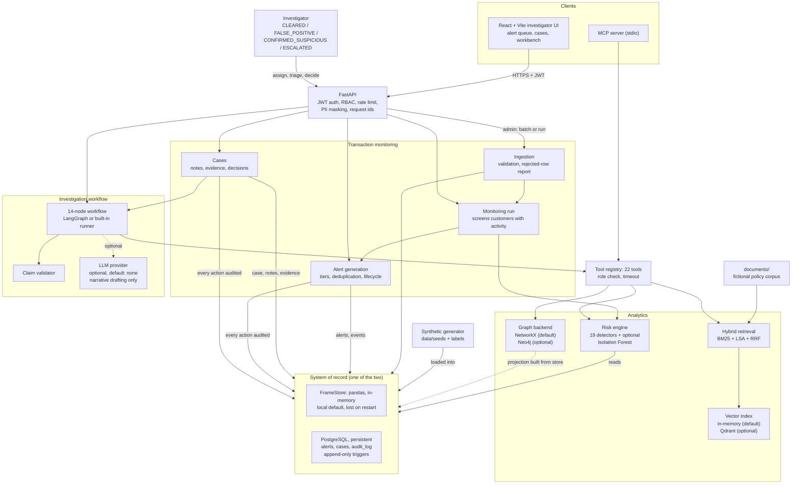
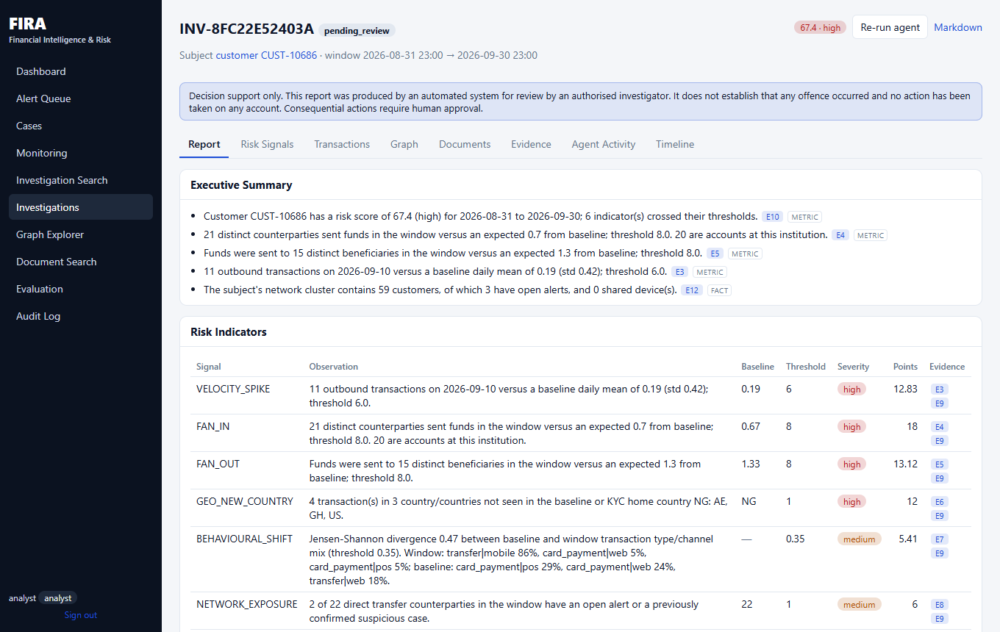

# FIRA — Financial Intelligence & Risk

> FIRA is a financial intelligence and risk investigation platform built using synthetic financial data. It
> demonstrates transaction monitoring, explainable risk detection, alert generation and triage, investigation workflows,
> graph analysis, hybrid evidence retrieval and auditability, together with production-oriented engineering practices
> (data-quality accounting, observability, security hardening, backup and restore, failure testing, CI gates). It is a
> **production-oriented prototype**: it is not a production banking system, is not regulatory-certified, has not been
> operated in production and has not been validated on real data.

**In 30 seconds**

* **Problem.** Financial institutions must detect, investigate and explain suspicious activity, and be able to defend each decision.
* **Solution.** Financial data processing and data-quality controls, explainable risk scoring, transaction-network analysis, investigation workflows with an audit trail, and an evidence-grounded AI assistant that cannot make decisions.
* **Engineering.** Python / FastAPI / PostgreSQL / SQL, React + TypeScript, ETL and data-quality checks, graph analytics (NetworkX; Neo4j optional), LLM integration with output validation, CI, Docker/Render blueprint.
* **Data.** Entirely synthetic. No real customers, no real money, nothing here is a legal or compliance conclusion.

It models the workflow of a bank's financial-crime operations team:

```
transactions → monitoring (deterministic detectors) → automatic alert → explainable risk score → case
  → investigator workbench (transactions, network, documents, evidence) → decision → audit trail → KPIs
```

Nothing here has been validated on real data, the metrics must not be read as real-world detection performance, and
no part of it has been deployed or security-reviewed (see [Limitations](#limitations)).

> **Decision boundary.** FIRA never freezes, closes or blocks accounts, never denies credit, never files regulatory
> reports and never states that anyone committed a crime. Alerts, scores and case states are created by deterministic
> code; an LLM (off by default) can only draft narrative text from stored evidence. Every decision is made and
> attributed to a human investigator.

> **What "production-oriented" does and does not mean.** The engineering practices are present and tested on synthetic
> data and a local PostgreSQL. It has **not** been deployed, load-tested at scale, security-reviewed by a third party or
> given real data; RPO 24 h / RTO 1 h are *targets*, not measurements; CI has not run; the Render blueprint has not been
> applied. See [Limitations](#limitations).

> **Two kinds of alerts, kept apart.** *FIRA monitoring alerts* are created by FIRA's own detectors during a monitoring
> run (`monitoring_alerts`). The *legacy seeded alerts* (table `alerts`, 265 open) are a synthetic upstream feed that
> ships with the dataset; FIRA reads them as context but never writes them.

## Contents

[Key capabilities](#key-capabilities) · [Architecture](#architecture) · [Technology stack](#technology-stack) ·
[Data](#data) · [Risk engine](#risk-engine) · [Monitoring, alerts and cases](#monitoring-alerts-and-cases) ·
[Investigation workflow](#investigation-workflow) · [AI / LLM](#ai--llm) · [Evaluation](#evaluation) ·
[Production-oriented engineering](#production-oriented-engineering) · [Performance](#performance) ·
[Installation](#installation) · [Testing](#testing) · [Demo](#demo) ·
[Screenshots](#screenshots) · [Deployment](#deployment) · [Security](#security) · [Limitations](#limitations) ·
[Roadmap](#roadmap) · [License](#license)

## Key capabilities

- **Transaction monitoring:** validated transaction ingestion and monitoring runs that screen customers with the
  deterministic detectors and create alerts automatically.
- **Explainable risk detection:** 19 deterministic detectors (burst, velocity, amount deviation, structuring, rapid
  pass-through, fan-in, fan-out, impossible travel, device sharing, circular flow, dormant reactivation and others) plus
  an optional Isolation-Forest signal. Scores are weight × strength with group caps, broken down by category, with
  the supporting transactions and a plain-language explanation. Configuration in YAML.
- **Data quality and coverage:** every incoming batch passes a validation gate (22 reason codes); rejected rows are
  quarantined with a sanitised copy and can be drilled into; a batch ledger enforces `received = processed + rejected +
  failed`; coverage, processing success, late, duplicate and missing counts are computed from stored values, never
  invented.
- **Explainable alert triage:** a deterministic 0-100 heuristic (12 documented factors, CRITICAL/HIGH/MEDIUM/LOW bands)
  stored with its factor breakdown; explicitly **not a probability**. Investigators get a "My Work" queue with overdue
  flags, and operational alert-quality metrics that use only valid denominators (no false-positive *rate* from alerts).
- **Money-mule indicators:** eight evidence-backed indicators (fan-in, fan-out, rapid movement, low retention, new or
  dormant account, shared device, flagged network, onward chain) with a flow graph; worded as risk indicators, never as
  proof.
- **Alert management:** deduplicated alerts with a lifecycle (NEW → TRIAGED → INVESTIGATING → ESCALATED → RESOLVED with
  CLEARED / FALSE_POSITIVE / CONFIRMED_SUSPICIOUS), queue filters, search, sorting, assignment, history.
- **Case management and workbench:** cases with their own state machine, notes, evidence, timeline and investigator
  decisions; one workbench screen with profile, risk, rules, transactions, 1 h / 24 h / 7 d / 30 d activity,
  counterparties, network, related alerts, retrieved documents and evidence.
- **Graph intelligence:** account, device, merchant and identifier relationships; clusters, shared devices, fund
  tracing, paths, cycles, direct and second-degree counterparties, shared beneficiaries (NetworkX by default, Neo4j
  optional for the original queries).
- **Document retrieval:** Markdown, PDF (including OCR for scanned pages) and DOCX; section-aware chunking; hybrid
  retrieval (BM25 + LSA, reciprocal rank fusion) with provenance.
- **Evidence grounding:** every claim cites evidence; evidence is classified as database fact, rule result, graph
  result, document evidence or (if an LLM is enabled) AI-generated summary, which is never a source of fact.
- **Investigation agent:** a 14-node stateful workflow over 22 permissioned tools that ends in `pending_review`.
- **Human review and audit:** formal investigator decisions with mandatory reasons; an audit log of logins, tool calls,
  alerts, cases, notes, evidence and decisions; database-enforced append-only history in PostgreSQL mode.
- **Operations and recovery:** business metrics and readiness with schema revision, an append-only configuration change
  log, login lockout and token revocation, production start-up checks, a least-privilege database role, `pg_dump`-based
  backup with encryption, verification and a **tested restore**, and failure-mode tests.
- **Evaluation and performance:** an independent labelled benchmark (precision, recall, F1, false-positive rate, PR-AUC,
  alerts per 1,000 transactions, latency) and a reproducible performance benchmark.
- **Operations:** JWT authentication, `analyst` / `admin` roles, PII masking, rate limiting, structured logs,
  `/health` and `/ready`, migrations, Docker Compose, a Render blueprint (not deployed), GitHub Actions workflow.
- **Interfaces:** FastAPI REST API (OpenAPI at `/docs`), a React + TypeScript investigator UI, an MCP server.

## Architecture



*Solid arrows are the default local path; "optional" components are off by default. FrameStore and PostgreSQL are
alternatives (`DATA_BACKEND=frames|postgres`), not used together. Detection, scoring, alert creation and every state
change are deterministic code; the LLM only appears on the narrative path. The diagram is derived from `backend/app`;
see [docs/TRANSACTION_MONITORING_ARCHITECTURE.md](docs/TRANSACTION_MONITORING_ARCHITECTURE.md) for the monitoring design
(state machines, deduplication policy, schema) and [docs/ARCHITECTURE.md](docs/ARCHITECTURE.md) for the original data flow.*

## Technology stack

| Area | Technology |
|---|---|
| Backend | Python 3.11+ (CI on 3.12), FastAPI, Pydantic v2, Uvicorn |
| Database | PostgreSQL 15+ (schema in `backend/app/db/schema.sql`, Alembic migrations 0001–0003, optional PostGIS layer); pandas-based in-memory `FrameStore` for local use |
| Risk | Deterministic detectors in `backend/app/risk`, YAML configuration, scikit-learn Isolation Forest (optional) |
| Graph | NetworkX (default); Neo4j 5 backend (optional) |
| Retrieval | LSA embeddings (scikit-learn), BM25 / PostgreSQL full-text, reciprocal rank fusion; in-memory vector index or Qdrant (optional) |
| Agent workflow | LangGraph (a built-in runner with identical semantics is used if LangGraph is absent); optional LLM providers over plain HTTP (Anthropic, OpenAI, Ollama) |
| Frontend | React 19, TypeScript, Vite |
| Testing | pytest + pytest-cov, ruff, mypy, bandit, pip-audit; Vitest (workflow helpers only), `tsc`, a Vite build and `npm audit` for the frontend |
| Deployment | Docker Compose (PostgreSQL/PostGIS, Neo4j, Qdrant, backend, nginx frontend); Render blueprint for a single-service synthetic demo (not deployed); GitHub Actions workflow |

## Data

All data is **synthetic** and produced by `backend/app/synthetic/generator.py`; nothing comes from a
real institution or customer.

| | Default dataset (`--customers 10000 --seed 42`) |
|---|---|
| Customers / accounts | 10,000 / 15,667 |
| Transactions | 254,197 |
| Merchants / devices | 2,000 / 14,003 |
| Injected scenarios | 11 (mule account, device-sharing ring, circular transfer, account takeover, burst, geographic anomaly, dormant reactivation, high-risk merchant, plus legitimate look-alikes) with ground-truth labels |
| Seeded legacy alerts | 515 in total: 265 open and 250 historical closed; randomly generated "legacy rule" noise, independent of the ground truth |
| Seeded historical investigations | 200 closed, randomly generated conclusions |
| Source documents | 12 registered: 11 files in `documents/` (Markdown, PDF, scanned PDF, DOCX; a fictional institution, "Lagoon Bank Plc") plus one generated "historical case notes" document built from the seeded investigations |
| Indexed chunks | 272 in the verified run (the unit the vector index and the dashboard's "indexed chunks" count). This was measured **without** the Tesseract OCR binary installed, so the scanned PDF memo yielded no chunks and the ingest report lists a warning for it. With Tesseract installed (the Docker image installs it) the count is higher |

The generator and the detectors were designed together. For the monitoring evaluation a separate benchmark
generator produces independent banks with new scenarios, evasive positives and ambiguous negatives. See
[Evaluation](#evaluation).

## Risk engine

For one customer and a lookback window (default 30 days against a 90-day baseline) the engine computes window and
baseline statistics identically, runs each detector, and turns every detector that crosses its threshold into a signal
with the observed value, baseline, threshold and the transaction ids behind it. Points are `weight × strength`, where
strength is 0.5 at the threshold and rises linearly to 1.0. Correlated signals share a group cap, and the total is
capped at 100. The API breaks the score down by category (transaction behaviour, fund flow, geographic, device and
identity, network, history, anomaly model). **There is no customer-profile or document component in the score**:
documents are retrieved as context only.

Version 2 added two detectors, STRUCTURING (near-threshold transactions inside a rolling window, using an *illustrative*
USD 10,000 threshold) and FAN_OUT, which moves the risk configuration to `default-2`. Thresholds and weights live in
[`default_config.yaml`](backend/app/risk/default_config.yaml) and are **engineering defaults, not regulatory values and not
calibrated on real data.** No LLM is involved. Details: [docs/RISK_ENGINE.md](docs/RISK_ENGINE.md).

## Monitoring, alerts and cases

**Monitoring run.** An admin (API/UI) or the CLI starts a run: customers with recent activity are assessed with the
risk engine and each triggered detector may create an alert. Runs are started on demand; there is no continuous or
scheduled monitoring yet. `POST /api/monitoring/transactions` ingests a batch through the data-quality gate (bad rows are
quarantined with reason codes, never silently dropped) and can monitor the affected customers immediately.

**Which detectors alert.** *Standalone* typology detectors (structuring, circular flow, mule patterns, burst, impossible
travel, device sharing, dormant reactivation, high-risk merchant) alert on their own. *Supporting* detectors that
compare a customer with their own baseline (new device, new country, unusual amount, volume spike) alert only when the
customer's combined score reaches the investigation threshold. *Context* signals (history, network exposure, behavioural
shift, ML) never alert. On the dev benchmark, letting every detector alert gave a 17.6% false-positive rate instead of
0.5% (see [Evaluation](#evaluation)).

**Deduplication.** At most one unresolved alert per customer and detector (enforced by a unique index in PostgreSQL): a
repeat detection merges into it (count, transactions, highest score); behaviour whose transactions were already resolved
is suppressed; genuinely new behaviour creates a new alert. Re-running monitoring is idempotent.

**Lifecycle.**

```
alert:  NEW → TRIAGED → INVESTIGATING → ESCALATED → RESOLVED  (CLEARED | FALSE_POSITIVE | CONFIRMED_SUSPICIOUS)
case:   OPEN → INVESTIGATING ⇄ PENDING_REVIEW,  INVESTIGATING → ESCALATED,  decision → CLOSED
```

Resolving or escalating needs a written reason; only the assignee (or an admin) may act on an item; a closing case
decision resolves its alerts and records the equivalent decision on a linked investigation. Details and the exact
policies: [docs/TRANSACTION_MONITORING_ARCHITECTURE.md](docs/TRANSACTION_MONITORING_ARCHITECTURE.md).

## Why this project matters

FIRA is a **synthetic-data** portfolio project that shows one person building, end to end, the pieces of a financial-intelligence platform:

| Skill area | What FIRA demonstrates (all implemented and tested) |
|---|---|
| **Data engineering** | seeded data generation, bulk `COPY` loading, row-level ingestion validation with 22 reason codes and batch accounting, a stored-dataset quality audit with a computed score, normalised PostgreSQL modelling with constraints, partial unique indexes and append-only triggers, ELT-style analytics derived from SQL/pandas, migrations, measured performance and index tuning |
| **FinTech / AML** | transactions, accounts, alerts, cases, investigations; 19 explainable detectors (structuring, fan-in/out, rapid pass-through, circular flow, device sharing...), money-mule indicators, heuristic alert triage, alert-quality metrics with valid denominators only |
| **Software engineering** | FastAPI + React/TypeScript, JWT/RBAC, 300+ backend tests, CI definition, Docker image, backup/restore with a tested restore, configuration governance |
| **AI** | an evidence-grounded investigation agent and a **copilot** that answers questions from retrieved FIRA records, separates observed facts from derived signals from AI interpretation, validates AI text against the evidence and degrades safely when the model is missing or wrong |
| **Graph analysis** | transaction-network projection, clusters, cycles, fund tracing, flow views, shared beneficiaries and devices |

It does **not** claim production readiness: the data is synthetic, nothing has been run on real customers, RPO/RTO are targets, CI and
the cloud deployment have not run, and the scores are heuristics for investigator review, not verdicts. Limitations are listed below.

## Employer demo (about 10 minutes)

1. Open the **Dashboard** (customers, accounts, transactions, open alerts, active investigations, data-quality status).
2. Open **Alert Queue** (sorted by triage score) or **Money-mule View** and pick a high-risk customer.
3. Open the **customer profile** and read the **risk score and the contribution chart**; open the transactions that support it.
4. Click through to the **Graph Explorer** or the money-flow view to see the connected accounts, amounts and direction.
5. In the **AI Investigation Copilot** panel ask *"Why was this customer classified as high risk?"* and *"Which transactions should be investigated first and why?"*: the answer separates **observed facts**, **derived signals**, an **AI interpretation** (labelled, validated, not evidence) and a **system recommendation**, and cites entity ids.
6. Click **Run investigation** (agent) to create an investigation with evidence; create a **case**, attach a transaction as evidence, add a note, record a decision.
7. Open the **Audit Log** and the case timeline to see every step, including `ai_investigation_requested` / `ai_response_generated`.
8. Open **Data Quality** to see the stored-dataset audit and the ingestion ledger.

Step-by-step with observed values: [docs/DEMO.md](docs/DEMO.md).

## AI Investigation Copilot

`POST /api/copilot/ask {customer_id, question}` -> structured JSON (`observed_facts`, `derived_signals`, `risk_factors`, `evidence`,
`interpretation`, `recommendations`, `limitations`). Retrieval is rule-driven from FIRA's stores and engines; an optional LLM writes one
paragraph that is **discarded if it names any entity not in the evidence**; with no provider (the default) a deterministic summary is used.
Hallucination controls, prompt-injection handling, audit events and tests: [docs/ai-investigation-copilot.md](docs/ai-investigation-copilot.md).
Environment: `LLM_PROVIDER` (none | anthropic | openai | ollama), `LLM_MODEL`, `LLM_API_KEY`, `LLM_BASE_URL`; no key is ever committed.

## Data quality

Two layers, both computed from data: the ingestion gate (what happened to incoming rows) and a **stored-dataset audit** (duplicates, invalid
amounts and currencies, orphan references, impossible states, freshness, a quality score): [docs/data-quality.md](docs/data-quality.md).
`GET /api/data-quality/dataset`.

## Documentation map

[Architecture overview (current vs future)](docs/ARCHITECTURE.md#fira-architecture-overview-current-implementation-vs-production-scale-future) ·
[Pre-upgrade audit](docs/FIRA_ARCHITECTURE_AUDIT.md) · [Data pipeline](docs/data-pipeline.md) · [Risk engine](docs/risk-engine.md) ·
[AML investigation](docs/aml-investigation.md) · [AI copilot](docs/ai-investigation-copilot.md) · [Data quality](docs/data-quality.md) ·
[Security](docs/SECURITY.md)

## Production-oriented engineering

What was added after the monitoring workflow, and where to read the evidence. Everything is on synthetic data.

| Capability | What exists | Read |
|---|---|---|
| Data-quality layer | validation gate, quarantine, batch ledger, coverage and success from real values, Data Quality page | [PRODUCTION_ORIENTED_ARCHITECTURE](docs/PRODUCTION_ORIENTED_ARCHITECTURE.md) §14 |
| Alert triage and quality | 12-factor heuristic, bands, outcome feedback, confirmation / false-discovery / closure rates, `not_computed` for FPR and recall | [ALERT_QUALITY](docs/ALERT_QUALITY.md) |
| Money-mule view | indicators, score, bands, flow graph, fan-in/fan-out search, benign context notes | [EVALUATION](docs/EVALUATION.md) Part 1b |
| Case management | state machine, assignment rules, priority change with reason, My Work queue, real-timestamp timeline | [API](docs/API.md) |
| Configuration governance | append-only change log, startup diff, allow-listed audited overrides, detector switch | [SECURITY](docs/SECURITY.md#configuration-governance) |
| Observability | JSON logs with service/operation/duration, business gauges, readiness with schema revision | [DEPLOYMENT](docs/DEPLOYMENT.md#operations) |
| Security hardening | lockout, logout revocation, body limit, production checks, least-privilege role, scans | [SECURITY](docs/SECURITY.md) |
| Backup and recovery | backup / verify / restore / restore-test scripts, restored-app check, failure scenarios | [DISASTER_RECOVERY](docs/DISASTER_RECOVERY.md) |
| Performance | latency, throughput, memory, index before/after, regression baseline | [PERFORMANCE](docs/PERFORMANCE.md) |
| Acceptance | a scripted end-to-end run over real HTTP | [ACCEPTANCE_TEST](docs/ACCEPTANCE_TEST.md) |

Two corrections made along the way are worth knowing about: a v2 dashboard KPI called "false-positive rate" was really a
share of resolved alerts and was renamed; and the first triage design failed its own evaluation (worse than the customer
risk score it was built on) and was revised once before a holdout run.

## Investigation workflow

```
signal → evidence → graph → documents → investigation → human review
```

1. A request such as "Investigate CUST-10686 over the last 30 days" is parsed for the subject (from a case, the
   workbench runs this for the case's customer).
2. A fixed plan runs tools: profile, transactions, window-vs-baseline statistics, risk signals, graph cluster / shared
   devices / fund tracing, policy retrieval per fired signal, and previous cases.
3. Evidence fusion stores each tool output as a numbered evidence item.
4. The report is assembled; claims are validated; the investigation becomes `pending_review`.
5. An investigator records a decision, which is stored with the investigation and the agent run.

## AI / LLM

- **LangGraph is used for workflow orchestration.** The workflow is a fixed graph of 14 nodes; the
  tool plan is chosen deterministically per investigation type.
- **The default workflow is deterministic.** With the default `LLM_PROVIDER=none`, no model is called
  and report narratives are rendered from evidence by code (`narrative_source: deterministic`,
  0 tokens).
- **LLM integration is optional.** Provider code for Anthropic, OpenAI and Ollama exists, but it has
  only been exercised with scripted test providers. It has **not** been called against a live model.
- **When enabled, the LLM only drafts narrative text** from an already-collected, masked evidence
  pack. It does not choose tools, change scores or take actions.
- **Claims are validated.** A claim must cite existing evidence; numbers, dates and entity ids must
  match the cited evidence; accusatory language and unattended action directives are rejected; one
  retry, then a deterministic fallback. The validator is rule-based, so it checks grounding, not
  reasoning quality.
- **Final decisions remain with human review.** No AI output changes an investigation's conclusion. Alert creation,
  scoring, deduplication and the alert and case state machines contain no model at all.
- FIRA has **not** been validated as a production AI or AML system.

## Evaluation

> **Everything here is measured on synthetic data whose scenarios were written by the same authors as the detectors.
> None of it is evidence of real-world AML or fraud detection performance.**

**Transaction-monitoring pipeline (v2).** An independent labelled benchmark with its own seeds, evasive positives that
the detectors are not designed to catch, and ambiguous negatives. A customer is positive if monitoring raised any alert.
Shipped thresholds; none tuned on these datasets.

| | Dev (seed 2025, 4,000 customers) | Holdout (seed 7, 3,000 customers) |
|---|---|---|
| Precision / recall / F1 | 0.858 / 0.865 / 0.861 | 0.878 / 0.860 / 0.869 |
| False-positive rate | 0.0049 | 0.0041 |
| PR-AUC (no-skill 0.033) | 0.859 | 0.855 |
| Alerts per 1,000 transactions | 20.1 | 19.7 |
| Detection time per customer (mean, p95) | 110 ms, 156 ms | 103 ms, 127 ms |

How to read it: every missed positive is an *evasive* scenario that fails by construction, every scenario the detectors
were designed for was alerted, and most false positives are deliberately ambiguous cases (a first-ever payroll run looks
like fan-out). Letting every detector alert (no tiers) gives precision 0.161 and a 17.6% false-positive rate on the dev
seed. The alert-tier design was influenced by an earlier smoke run on the same generator (disclosed in
[docs/EVALUATION.md](docs/EVALUATION.md), together with the limitations and reproduction commands).

**Original risk benchmark (risk configuration `default-1`, kept unchanged).**

| | dev (seed 42, 10k customers) | holdout (seed 7, 5k customers) |
|---|---|---|
| Risk precision / recall / F1 | 0.991 / 0.890 / 0.938 | 0.991 / 0.912 / 0.950 |
| False-positive rate (labelled legitimate) | 0.005 | 0.003 |
| ROC AUC | 0.998 | 0.999 |
| Hybrid retrieval R@5 / MRR (25 queries) | 0.947 / 0.953 | same corpus |

These come from data designed alongside the detectors (the benchmark largely measures whether the engine finds what the
generator planted), and some signals are weak even there (for example HISTORICAL_ALERTS precision 0.32). A re-run on
2026-10-03 on another machine (ML model untrained, Tesseract absent) gave recall 0.882 and hybrid R@5 0.933: close but not
identical, so treat the numbers as environment-dependent.

**Production-oriented additions (v3, holdout seed 7, independent benchmark with a money-mule family).** Customer-level detection:
precision 0.838, recall 0.829, FPR 0.0073. Triage priority tracks oracle-confirmed rate monotonically (CRITICAL 100%, HIGH 98%, MEDIUM 82%) but is **not**
a better ranking than the customer risk score (AUC 0.83 vs 0.92). The money-mule score ranks well (AUC 0.97) but its MEDIUM-or-above cut-off
has precision 0.54 / recall 0.57, below the existing fan-in / rapid-pass-through alerts (F1 0.56 vs 0.72). The first triage design failed its own
evaluation and was revised once on the development seed before the holdout was run; all of it is in [docs/EVALUATION.md](docs/EVALUATION.md) Part 1b and
[docs/ALERT_QUALITY.md](docs/ALERT_QUALITY.md). FPR and recall are not computed from the alert workflow because it has no verified true negatives.

## Performance

Measured on one 2012-era 4-core machine, single process, synthetic data, PostgreSQL 15 in Docker
([docs/PERFORMANCE.md](docs/PERFORMANCE.md)). Risk assessment costs about 100 to 118 ms per customer regardless of bank size, so monitoring cost
follows the number of customers screened: a daily batch of 1,153 active customers in a 251,346-transaction bank took 130 s in memory and
155 s on PostgreSQL (about 7.5 to 9 customers per second). Alert-queue pages took 10 to 28 ms, the full case workbench 0.26 to 0.58 s,
a money-mule assessment 0.12 to 0.15 s. After measuring, four partial indexes cut the investigator queries from 10 to 118 ms to 0.2 to 1 ms on
300,000 synthetic alerts. The ingestion gate processes 240 to 960 rows/s with 10% invalid rows (slower as the bank grows because every accepted
batch rebuilds the in-memory graph). Memory peaked at 677 MB (memory mode) and 806 MB (PostgreSQL) at 251k transactions. Sizes run: 10k, 100k and
251k transactions; **1,000,000 was not run** because the machine could not hold it safely. A regression baseline is committed.

## Testing

All commands run from `backend/` with the virtual environment active.

```bash
python -m pytest -q tests/unit tests/agent tests/e2e                       # no external services needed
python -m pytest -q tests/unit tests/agent tests/e2e --cov=app --cov-report=term-missing
python -m pytest -q                                                        # everything; service tests skip themselves
ruff check app tests
mypy app
bandit -c pyproject.toml -r app -ll
pip-audit -r requirements.txt
cd ../frontend && npm ci && npm run typecheck && npm test && npm run build && npm audit
```

| Suite | Needs |
|---|---|
| `tests/unit`, `tests/agent`, `tests/e2e` (detectors, alert generation, deduplication, lifecycle, cases, API and RBAC, data-quality gate, triage, alert quality, money-mule indicators, configuration governance, security hardening, failure modes, OpenAPI, label-leakage, evaluation metrics, deployment) | nothing (in-process stack) |
| `tests/integration` `PostgresStoreTest`, `AuditAppendOnlyTest`, `ApiStackTest`, the monitoring workflow re-run on PostgreSQL, constraint, atomicity and ledger tests, failure modes (killed connections, restart, schema behind, bad migration), least-privilege role | PostgreSQL 15+ (`DATABASE_URL`; the monitoring tests create and drop their own databases, so the role needs `CREATEDB`) |
| `tests/integration` Qdrant test | Qdrant (`QDRANT_URL`) |
| `tests/integration` Neo4j test | Neo4j 5 (`NEO4J_URI`, `NEO4J_USER`, `NEO4J_PASSWORD`) |
| `tests/agent/test_agent.py::LangGraphParityTest` | LangGraph installed |
| Docker | only to start the services above (for example `docker run postgres:15`) |

Service tests are skipped, not failed, when their service variable is unset.

**Snapshot of the verified run (2026-10-03, Windows 10, Python 3.13; environment-specific, not a permanent guarantee):**

| Check | Result |
|---|---|
| `tests/unit tests/agent tests/e2e` | **311 passed, 1 skipped; 81% line coverage** (10,767 statements; the PostgreSQL repository code is exercised by the integration suite below). CI enforces a 75% floor |
| `tests/integration` + LangGraph parity against PostgreSQL 15 (Docker container) | **70 passed, 2 skipped** (Neo4j and Qdrant not configured in this pass; the previous pass ran Qdrant 1.12 with 56 passed). Includes the monitoring workflow re-run on PostgreSQL, constraint, atomicity, append-only, ledger, failure-mode and least-privilege tests |
| Vitest (`npm test`) | 23 passed |
| Neo4j graph test, Qdrant test (this pass) | **NOT RUN**: the Neo4j image could not be pulled in this environment, so the Neo4j backend is still untested here; Qdrant was not started for the final pass |
| End-to-end acceptance script against a live API and PostgreSQL (15 steps incl. backup and restore) | **15 of 15 passed**: [docs/ACCEPTANCE_TEST.md](docs/ACCEPTANCE_TEST.md) |
| Backup, verify, restore test and restored-application check | passed (restore step 21 s on a 15,000-transaction database): [docs/DISASTER_RECOVERY.md](docs/DISASTER_RECOVERY.md) |
| Full `docker compose` stack, `render.Dockerfile` build, Render deployment | **NOT RUN** |
| GitHub Actions | **NOT RUN** (runs only after the repository is pushed) |
| `ruff check`, `mypy` (105 files incl. the backup scripts) | clean |
| `bandit -ll` | no medium or high severity issues |
| `pip-audit -r backend/requirements.txt` | no known vulnerabilities (point-in-time; dependencies are unpinned) |
| `npm run typecheck`, `npm run build`, `npm audit` | pass; 0 vulnerabilities |

CI (`.github/workflows/ci.yml`) is defined for lint, type check, unit tests with a coverage floor, integration tests with
service containers (migration up/down/up and a backup-restore step), an advisory performance smoke job, bandit / pip-audit / npm audit / a secret-pattern scan, the frontend build and tests, and Docker image
builds. It has **not run yet**, because it only executes once the repository is on GitHub.

## Demo

[docs/DEMO.md](docs/DEMO.md) is a 15-minute walkthrough with verified values: run monitoring, ingest new transactions
and watch a STRUCTURING alert appear, work it in the alert queue, create a case, use the workbench, record a decision,
read the audit trail and the KPIs. `infrastructure/scripts/demo_api_walkthrough.py` performs the same flow against a running
API. Customer ids in the guide depend on the default seed.

## Screenshots

All screenshots use synthetic data and no credentials.

| | |
|---|---|
|  **Dashboard with monitoring KPIs** |  **Alert queue** |
|  **Alert explanation and history** |  **Case workbench: overview and risk** |
|  **Triggered rules** |  **Transaction network** |
|  **Classified evidence** |  **Investigator decision** |
|  **Case timeline** |  **Audit log** |
|  **Monitoring runs** |  **Evidence-grounded report** |

## Deployment

A single-service public demo is described in [docs/DEPLOYMENT.md](docs/DEPLOYMENT.md): `render.yaml` and
`infrastructure/docker/render.Dockerfile` (FastAPI serving the built UI, PostgreSQL, no Neo4j/Qdrant/LLM).
**Status: not deployed.** The blueprint and image have not been run on Render; what was verified locally is listed in that
document. Docker Compose remains the full local stack.

## Security

JWT authentication (HS256) with scrypt password hashing, role-based access control enforced at the
API and tool layers, rate limiting, login lockout, logout revocation, request-size limits, PII masking, an audit trail, an
append-only configuration change log, production start-up checks and a least-privilege database role. This is a prototype that
has not been security-reviewed or penetration-tested. Known gaps include lockout, revocation and rate limiting that are
per process, no per-case confidentiality (any analyst can read any case), and an audit log and history tables that are
append-only but not tamper-proof. `bandit`, `pip-audit`, `npm audit`, `ruff` and `mypy` were clean at the last run. How to report
a vulnerability: [SECURITY.md](SECURITY.md).
Full details and limitations: [docs/SECURITY.md](docs/SECURITY.md). No credentials are committed;
`.env.example` lists the settings.

## Limitations

- **Synthetic data only.** Nothing has been validated on real transactions, customers or policies. "Lagoon Bank Plc" and
  its documents are fictional and reflect no real law or regulation; the USD 10,000 structuring threshold is illustrative.
- **Circular evaluation.** Detectors, scenarios and thresholds were designed by the same people. The monitoring benchmark
  adds evasive positives and ambiguous negatives, but they are our choices; metrics are not real-world performance. The
  alert-tier design was influenced by a smoke run on the same generator.
- **Monitoring is on demand.** There is no continuous or scheduled monitoring, no streaming ingestion and no job queue;
  runs are synchronous and cost about 0.1 s per customer in one process.
- **Uncalibrated configuration.** Weights, thresholds and alert tiers are engineering defaults. No unusual-balance-movement
  detector exists (the data has no balance history).
- **No live LLM validation.** The LLM path has only run with scripted providers; the default workflow uses no LLM.
- **Frames mode is not durable.** Alerts, cases, notes, decisions, users and audit entries are in memory and have no rollback;
  PostgreSQL mode adds persistence and per-operation transactions.
- **Access control is coarse.** Two roles; assignment-based write access; any analyst can read any case; no four-eyes on
  case decisions; token revocation and login lockout exist but are per process.
- **The copilot is grounded, not infallible.** Intent detection is keyword-based; the AI paragraph is validated for entity ids and a few accusatory
  patterns, not for every claim; no live LLM provider has been exercised (tests use a scripted provider); prompt injection through data fields has
  not been red-teamed. With no provider it uses a deterministic summary.
- **The stored-dataset audit reads the whole transaction table** (about 0.3 s at 15,000 rows) and finds nothing in the generated data because the generator produces clean data; its checks are proven by fault-injection tests.
- **Triage and the money-mule view are heuristics, tuned once on synthetic data.** Triage is not a probability and is not a
  better ranking than the customer risk score it contains (holdout AUC 0.83 vs 0.92); the mule bands are not a better classifier
  than the existing fan-in / rapid-pass-through alerts (holdout F1 0.56 vs 0.72). Neither has seen a real investigator.
- **Recovery is a script, not a service.** Backups are not scheduled or stored off the host, there is no point-in-time recovery,
  and RPO 24 h / RTO 1 h are targets. Only the restore step has been timed, on a 15,000-transaction database.
- **A free hosting tier has no dependable backups.** Do not assume the Render demo is backed up.
- **Not exercised end to end:** the full Docker Compose stack, the GitHub Actions pipeline and the Render deployment.
  Neo4j-backed tests were not run in the last verification pass, and the new network queries are NetworkX-only.
- **Scale and performance.** Measured only up to about 254k transactions on one small machine; ingestion rebuilds the graph
  projection; queue latency with very many alerts is unmeasured. No partitioning or orchestration.
- **Frontend tests are minimal:** unit tests for the workflow helpers; no component or browser tests.

## Roadmap

See [docs/ROADMAP_AND_RISKS.md](docs/ROADMAP_AND_RISKS.md) for the executed roadmap, the verification
status, the risk register and the not-yet-built items (continuous monitoring, an incremental graph projection, shared token
revocation, scheduled off-host backups and per-case access control among them).

## License

Released under the [MIT License](LICENSE). Copyright (c) 2026 Tunde Shiyanbade.

## Further documentation

[TRANSACTION_MONITORING_ARCHITECTURE](docs/TRANSACTION_MONITORING_ARCHITECTURE.md) · [ARCHITECTURE](docs/ARCHITECTURE.md) ·
[DATA_MODEL](docs/DATA_MODEL.md) · [RISK_ENGINE](docs/RISK_ENGINE.md) · [GRAPH_MODEL](docs/GRAPH_MODEL.md) ·
[RAG_ARCHITECTURE](docs/RAG_ARCHITECTURE.md) · [AGENT_ARCHITECTURE](docs/AGENT_ARCHITECTURE.md) ·
[EVALUATION](docs/EVALUATION.md) · [ALERT_QUALITY](docs/ALERT_QUALITY.md) · [PERFORMANCE](docs/PERFORMANCE.md) ·
[SECURITY](docs/SECURITY.md) · [DISASTER_RECOVERY](docs/DISASTER_RECOVERY.md) · [DEPLOYMENT](docs/DEPLOYMENT.md) ·
[API](docs/API.md) · [DEMO](docs/DEMO.md) · [ACCEPTANCE_TEST](docs/ACCEPTANCE_TEST.md) ·
[PRODUCTION_ORIENTED_ARCHITECTURE](docs/PRODUCTION_ORIENTED_ARCHITECTURE.md) · [ROADMAP_AND_RISKS](docs/ROADMAP_AND_RISKS.md)

```
backend/app/        api, agents, analytics, risk, monitoring (alerts, cases, ingestion, benchmark), graph,
                    retrieval, documents, memory, tools, security, evaluation, llm, mcp, data (stores),
                    db (schema, loader), synthetic (generator, monitoring benchmark)
backend/tests/      unit, agent, e2e, integration
frontend/           React + TypeScript investigator UI (Vite)
documents/          fictional policy corpus incl. PDF / scanned PDF / DOCX
evaluation/         retrieval judgements and committed benchmark results (risk and monitoring)
data/seeds          generated dataset (git-ignored)
infrastructure/     Dockerfiles, nginx, scripts (backup/restore, acceptance test, index review), sql (least-privilege role)
docs/               design documentation, demo guide, screenshots
```
