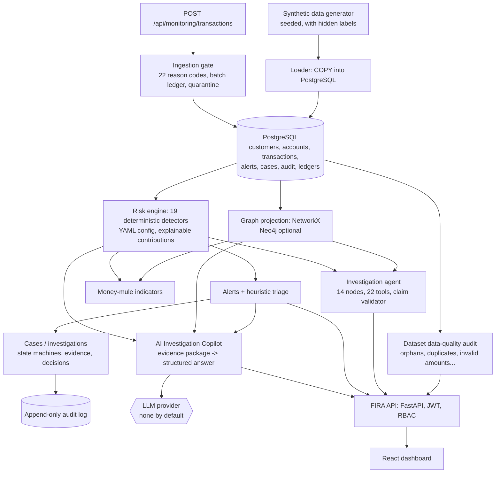

# Architecture

> A simplified component diagram (Mermaid) that distinguishes default from optional components is in the
> [README](../README.md#architecture). The sections below describe the full design, including the
> Docker-mode components (PostgreSQL, Neo4j, Qdrant). Frames mode replaces PostgreSQL with an in-memory
> pandas store; NetworkX and an in-memory vector index replace Neo4j and Qdrant by default.

## A. System architecture and data flow

```
                          ┌──────────────────────────────┐
                          │ React investigator UI (nginx)│   MCP clients (stdio)
                          └──────────────┬───────────────┘          │
                                         │ HTTPS / JWT              │ API key → role
                          ┌──────────────▼───────────────┐   ┌──────▼──────┐
                          │ FastAPI gateway              │   │ MCP server  │
                          │ auth · RBAC · rate limit ·   │   └──────┬──────┘
                          │ request-id · masking · audit │          │
                          └──────────────┬───────────────┘          │
                                         ▼                          ▼
     ┌────────────────────────────────────────────────────────────────────────────┐
     │ Tool registry (22 tools): input schema · role · timeout · error envelope · │
     │ output schema · audit record                                               │
     └───────┬───────────────────────┬───────────────────────┬────────────────────┘
             │                       │                       │
   ┌─────────▼────────┐    ┌─────────▼─────────┐   ┌─────────▼─────────┐
   │ Risk intelligence│    │ Graph intelligence│   │ Document          │
   │ stats · detectors│    │ Neo4j / NetworkX  │   │ intelligence      │
   │ scoring · ML     │    │ projection        │   │ parse→chunk→embed │
   └─────────┬────────┘    └─────────┬─────────┘   └─────────┬─────────┘
             │                       │                       │
   ┌─────────▼────────┐    ┌─────────▼─────────┐   ┌─────────▼─────────┐
   │ PostgreSQL       │    │ Neo4j             │   │ Qdrant (vectors)  │
   │ (+PostGIS)       │───▶│ (projection built │   │ + Postgres FTS    │
   │ system of record │    │  from Postgres)   │   │ (keywords, text)  │
   └──────────────────┘    └───────────────────┘   └───────────────────┘

   Investigation agent (explicit state graph, LangGraph):
   understand → classify → plan → structured data → risk analytics → graph → documents
   → history (episodic memory) → evidence fusion → risk assessment → report (LLM optional)
   → claim validation (retry once) → human review (pending_review)
```

**Data flow for one investigation**

1. The request ("Investigate customer CUST-10291 … last 30 days") is parsed deterministically for
   the subject id and the lookback period. If there is no subject, the run stops with
   `needs_input` and an "Insufficient evidence" outcome.
2. The subject is resolved to the customer whose behaviour will be analysed. An account resolves to
   its owner, a transaction to its account owner, and a device to its most active user. An
   `investigations` row is created.
3. A **deterministic plan** fixes which tools run for this investigation type. The LLM never
   chooses tools.
4. Structured data is fetched through tools: the profile with masked identifiers, the window
   transactions, and window-vs-baseline statistics.
5. The risk engine computes every detector and the score. Detectors that need relationships call
   the graph backend.
6. The graph tools return the cluster, shared devices, fund flows and connected accounts.
7. Hybrid retrieval runs one query per fired signal (from a fixed signal → query playbook) over the
   policy corpus.
8. Episodic memory recalls previous investigations on the subject and connected customers, and
   similar case notes.
9. Evidence fusion turns every tool output into `EvidenceItem`s (E1…En) with source, type, content
   and confidence, and stores them.
10. The fact sections (indicators, transactions, graph, documents, score breakdown, uncertainty)
    are rendered **deterministically** from the evidence.
11. The narrative sections (summary, interpretation, recommendations) are drafted by the LLM when
    one is configured, otherwise by transparent rules. Either way they are **validated** claim by
    claim (citations, numbers, dates, entity ids, language, action boundary). Unsupported claims
    are removed. A failing LLM draft gets one retry with feedback, and the deterministic text is
    the fallback.
12. The investigation moves to `pending_review`. The agent episode (plan, tool calls,
    observations, evidence refs, a concise reasoning summary and metrics) is stored. No
    chain-of-thought is stored.
13. The analyst decides. The decision is stored, attached to the episode, and feeds failure
    classification and the controlled improvement loop.

## B. Technology decisions (and why)

| Choice | Why | Alternatives considered |
|---|---|---|
| **Python / FastAPI / Pydantic** | One language for data, ML, graph and API. Pydantic models are the contract shared by tools, the agent, the API and OpenAPI docs | Django (heavier), Flask (no typing/OpenAPI) |
| **PostgreSQL as system of record** | ACID writes for investigations, evidence, decisions and audit; strong indexing for per-account time-window scans; FTS for keyword retrieval; PostGIS for geospatial | — |
| **SQL text + SQLAlchemy Core, schema in `schema.sql`** | The DDL is reviewable as one file and validated directly against PostgreSQL. Every statement is a bound-parameter constant (`SQL` dict), which makes the injection boundary auditable. Alembic applies the schema and versions future changes | ORM models (duplicates the DDL, hides queries) |
| **PostGIS** (optional layer) | Geography columns and GiST indexes for set-based proximity queries. Detectors use the identical haversine maths on already-scoped frames | earthdistance |
| **pgvector — not used** | Qdrant is the single vector store. Keeping vectors in two places creates two sources of truth that drift | pgvector-only (viable for small corpora; documented as an option) |
| **Neo4j with a deliberate projection** | Variable-length traversals (cycles, paths, clusters) are what graph databases are for. Only relationships are projected, aggregated per edge; transactions stay in Postgres | Full relational copy (wasteful), recursive CTEs (slow beyond 3 hops) |
| **NetworkX backend** | Same interface, runs in-process for development, tests and the offline benchmark. Neo4j answers are cross-checked against it in integration tests | — |
| **Qdrant** (REST via stdlib) | Purpose-built vector search with payload filters. Talking to the documented REST API avoids the gRPC dependency chain | pgvector, FAISS |
| **LSA embeddings by default** | Local, deterministic, no GPU and no network, so the stack runs offline and CI is reproducible. Quality is measured, and the provider is swappable (`EMBEDDING_PROVIDER=openai`) | sentence-transformers (needs torch, roughly 2 GB) |
| **Hybrid retrieval with RRF** | Policy questions mix exact terms ("tipping off") with paraphrase. Rank fusion needs no score calibration | Semantic only (lower P@1 in our benchmark) |
| **Docling optional** | High-fidelity layout parsing, but it pulls ML models (around 2 GB). The default parsers handle text PDFs with tables, scanned PDFs (Tesseract) and DOCX | Docling always on |
| **LangGraph for orchestration** | Explicit nodes, edges and conditional routing instead of an unbounded LLM loop. The workflow is declared once (`WorkflowSpec`) and compiled to LangGraph, or to an equivalent built-in runner when LangGraph isn't installed | Free-form ReAct loop (non-deterministic tool use, harder to audit) |
| **Provider-agnostic `LLMProvider`** | Anthropic, OpenAI-compatible and Ollama (local) over plain HTTP. The model comes from env vars. The default is `none` | Vendor SDK lock-in |
| **MCP** | Exposes the same permissioned tools to external agents. Every call goes through the tool registry, so it gets the same checks and audit | Bespoke plugin API |
| **scikit-learn Isolation Forest** | Unsupervised, so it needs no scarce or biased labels. It works on interpretable engineered features and is reported as a separate ML signal with a small weight | Gradient boosting (needs labels; would learn the synthetic generator) |
| **React + TypeScript, no UI kit, SVG graph** | A small dependency surface and a functional UI. The graph layout is a deterministic force simulation | d3/cytoscape (more dependencies) |
| **Docker Compose** | Five services on a modest machine. Kubernetes is not justified at this size | Kubernetes |

## C. Repository assessment

The workspace was empty when the build started. The user's existing *Enterprise Banking Data &
Analytics Platform* (PostgreSQL/Oracle/SQL Server/MongoDB/Cassandra ETL with a Bronze/Silver/Gold
medallion and Airflow) was not in any repository available to this build. FIRA is therefore a
standalone repository, designed to **consume** a Gold layer rather than duplicate it:

- `app/db/loader.py` is the only ingestion path. Replacing `prepare_frames()` with a reader over the
  platform's Gold tables (customers, accounts, transactions, merchants, devices) is enough. The
  column contracts are in [DATA_MODEL.md](DATA_MODEL.md).
- Airflow can schedule `python -m app.db.loader`, `python -m app.graph.neo4j_backend load` and
  `python -m app.evaluation.runner all` as tasks.
- The platform's existing fraud/AML scores can be loaded as `alerts` and become the
  `HISTORICAL_ALERTS` and `NETWORK_EXPOSURE` evidence.

## Module map

| Package | Responsibility |
|---|---|
| `app/data` | `DataStore` protocol; `SqlStore` (PostgreSQL), `FrameStore` (pandas) |
| `app/db` | schema, PostGIS layer, loader, bootstrap |
| `app/synthetic` | data generator with ground truth |
| `app/analytics` | period statistics, pass-through matching, geospatial |
| `app/risk` | detectors, scoring, config, ML |
| `app/graph` | projection, NetworkX and Neo4j backends |
| `app/documents` | parsing, classification, chunking, ingestion |
| `app/retrieval` | embeddings, BM25, vector stores, repositories, hybrid retriever |
| `app/tools` | registry and the 22 investigator tools |
| `app/agents` | workflow, runtime, evidence fusion, report, validator |
| `app/memory` | episodic memory |
| `app/evaluation` | metrics, benchmarks, runner, improvement loop |
| `app/security` | auth, principals/roles, masking, rate limiting |
| `app/api`, `app/main.py` | REST API |
| `app/mcp` | MCP server |
| `app/core` | logging, context, metrics, HTTP helpers |
| `app/services/container.py` | wiring: chooses each implementation from settings |

---

> **Requested file name.** The brief asked for `docs/architecture.md` and `docs/security.md`. On case-insensitive file systems (Windows, default macOS) those names are the same files as this `ARCHITECTURE.md` and `SECURITY.md`, so the new content lives here and in [SECURITY.md](SECURITY.md) instead of in duplicates.

# FIRA architecture overview: current implementation vs production-scale future

FIRA is a **synthetic-data** financial-crime intelligence platform: a modular monolith (FastAPI + React + PostgreSQL) with
deterministic detection, graph analysis, an evidence-driven investigation workflow and a grounded AI copilot. Nothing here uses
real customer data. This page separates what **is implemented** from what a production-scale deployment **would add**.

## Current implementation (end-to-end flow)



| Layer | Technology | Where | Required at runtime |
|---|---|---|---|
| Frontend | React 19, TypeScript, Vite | `frontend/` | yes (static build) |
| API | FastAPI, Pydantic v2, uvicorn | `backend/app/api/`, `main.py` | yes |
| Store | PostgreSQL 15+ (SQLAlchemy, Alembic 0001-0004) or in-memory pandas for offline runs | `app/data/`, `app/db/` | yes |
| Detection | deterministic Python detectors + YAML configuration | `app/risk/` | yes |
| Monitoring | alerts, triage, cases, ingestion gate, governance | `app/monitoring/` | yes |
| Graph | NetworkX (default), Neo4j (optional) | `app/graph/` | NetworkX built in |
| Agent / RAG | built-in workflow runner or LangGraph; BM25 + LSA retrieval | `app/agents/`, `app/retrieval/` | yes (works without an LLM) |
| Copilot | rule-based intents, evidence package, optional LLM | `app/copilot/` | optional LLM |
| Observability | JSON logs, Prometheus-text metrics, health/readiness, audit | `app/core/` | yes |

### Mapping to the conceptual pipeline

| Concept | Implemented as |
|---|---|
| Synthetic banking data | `app/synthetic/generator.py` (+ `monitoring_benchmark.py` for evaluation banks) |
| Data ingestion | loader (bulk) and `service.ingest` (API batches) |
| Validation / data quality | ingestion gate **and** stored-dataset audit (`docs/data-quality.md`) |
| ETL / ELT | generator -> CSV.gz -> `COPY` -> SQL; derived views (graph projection, activity windows, baselines) computed from SQL/pandas at run time (`docs/data-pipeline.md`) |
| PostgreSQL | system of record |
| Feature engineering | per-customer baselines, windows, peer statistics inside the risk engine |
| Risk / AML detection | `app/risk/engine.py`, 19 detectors |
| Risk scoring | deterministic score with factor contributions |
| Graph analysis | NetworkX projection and queries |
| Investigation engine | agent + cases + workbench |
| Evidence / audit | evidence classes, append-only audit log |
| AI Investigation Copilot | `app/copilot/service.py` |
| FIRA API / dashboard | FastAPI + React |

## Graph store: current implementation vs future production option

| | Status |
|---|---|
| **Current implementation** | NetworkX, in-process, projected from the relational data. It is the default and is what all tests, the offline benchmark and the acceptance run use. Neo4j is **not required**. |
| Neo4j backend | **Optional**, selected by configuration (`docker-compose` provides a container). It implements the original graph queries only; integration tests that compare it with NetworkX need a running Neo4j and were **not run** in this validation. The newer analytics (mule indicators, shared-device clusters) are NetworkX-only. |
| **Future production option** | A dedicated graph database with an incremental projection, for volumes where in-process graphs stop fitting. Not built, not benchmarked. |

## Production-scale future architecture (NOT implemented)

The following would be sensible at real volumes and are **not in this repository**:

* a streaming ingestion layer (for example Kafka) replacing batch/API ingestion;
* a distributed transformation engine (Spark/Databricks) and an orchestrator (Airflow/Dagster) with dbt-style tested models;
* a dedicated graph database (Neo4j is supported by the interface for the original queries but the newer analytics are NetworkX-only);
* table partitioning, read replicas, and an incremental graph projection;
* a managed secrets store, SSO/OIDC, shared rate-limit and revocation state;
* a feature store and model registry if learned models were adopted.

They are listed so the design's direction is clear; none is claimed as done.

## Design principles

1. **Deterministic first.** Scores, alerts and graph findings come from code and configuration, reproducibly.
2. **Evidence before narrative.** Every statement should point at a database record, a computed signal or a retrieved passage.
3. **AI is a reader, not a source.** The LLM may phrase an interpretation of an evidence package; it cannot add facts, and its text is validated against the package and labelled.
4. **Human in the loop.** The system recommends; people decide; decisions are attributed and audited.
5. **Honest measurement.** Metrics only where the denominator exists; synthetic-data limits stated.

## Related documents

[data-pipeline](data-pipeline.md) · [risk-engine](risk-engine.md) · [aml-investigation](aml-investigation.md) ·
[ai-investigation-copilot](ai-investigation-copilot.md) · [data-quality](data-quality.md) · [SECURITY](SECURITY.md) ·
[audit of the pre-upgrade state](FIRA_ARCHITECTURE_AUDIT.md) · deeper design: [TRANSACTION_MONITORING_ARCHITECTURE](TRANSACTION_MONITORING_ARCHITECTURE.md),
[PRODUCTION_ORIENTED_ARCHITECTURE](PRODUCTION_ORIENTED_ARCHITECTURE.md)
