# Demo guide (about 15 minutes)

A walkthrough of the transaction-monitoring workflow on **synthetic data**, from transactions to alerts to a case to
a recorded decision and its audit trail. Every value below was observed in a real run on the default dataset
(`--customers 10000`, seed 42, risk configuration `default-2`); the guide says where values depend on the run.

```
transactions → detection → automatic alert → risk score → case → investigation → evidence → decision → audit → KPIs
```

> **The customer ids and numbers depend on the seed dataset.** Regenerate with other parameters and they change.
> Alert ids (`MAL-…`), case ids and timestamps are different on every run.

## 0. Start from a clean checkout

Windows PowerShell shown; Linux/macOS equivalents are in the README. Frames mode keeps everything in memory, so
restarting the API resets the demo (use PostgreSQL mode to keep state).

```powershell
py -m venv .venv ; .\.venv\Scripts\Activate.ps1
pip install -r backend\requirements-dev.txt
cd frontend ; npm ci ; cd ..\backend

python -m app.synthetic.generator --out ..\data\seeds --customers 10000
$env:DATA_BACKEND="frames"; $env:DATASET_DIR="..\data\seeds"; $env:MODEL_DIR="..\data\models"
python -m app.documents.pipeline ingest

$env:FIRA_ENV="development"
$env:BOOTSTRAP_ADMIN_PASSWORD="choose-a-password"; $env:BOOTSTRAP_ANALYST_PASSWORD="choose-another-one"
uvicorn app.main:app --port 8000          # terminal 1
# terminal 2:  cd frontend ; npm run dev   -> http://localhost:5173
```

The dashboard should read 10,000 customers, 15,667 accounts and 254,197 transactions, and the *Transaction
monitoring* block should show zeros / dashes: **no FIRA alerts exist until monitoring runs.** The 265 "open legacy
alerts" are the seeded synthetic upstream feed, a different thing.

## Part A. In the UI

### 1. Run monitoring (admin)

Sign in as `admin`, open **Operations**, enter `CUST-10686, CUST-17781` in *Only these customers*, press **Run
monitoring**. Observed: *2 customers screened, 8 alerts created, 0 merged, 0 suppressed* (a few hundred ms).

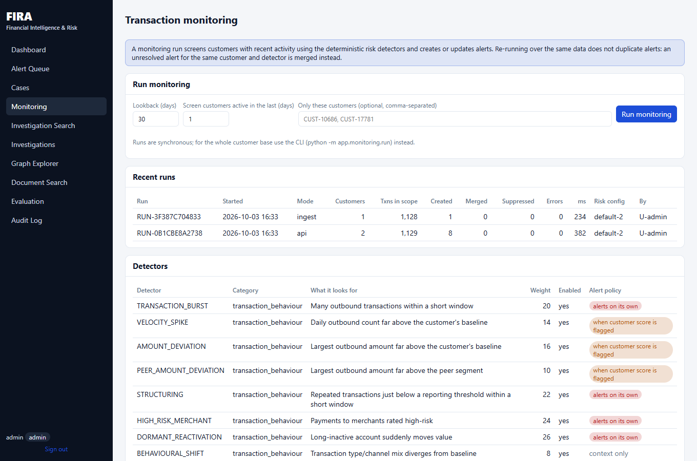

These two customers come from the generator's ground truth (a mule account and a circular-transfer participant). The
engine does not see the labels. Press **Run monitoring** again: nothing new is created and the alerts are merged
instead (deduplication), so re-running is safe.

### 2. New transactions arrive

Alerts also appear when transactions are ingested. In a third terminal (standard library only):

```powershell
python infrastructure\scripts\demo_api_walkthrough.py --url http://localhost:8000 `
  --admin-password $env:BOOTSTRAP_ADMIN_PASSWORD --analyst-password $env:BOOTSTRAP_ANALYST_PASSWORD `
  --customer CUST-19752 --ingest-only
```

CUST-19752 is an ordinary customer: monitoring finds **0 alerts** for them. The script ingests four transfers of USD
9,100 to 9,600 within seven hours (just under the illustrative USD 10,000 reporting threshold). Observed: *accepted
4, rejected 0; monitoring created 1 alert*. The transaction count on the dashboard goes up by 4.

### 3. The alert queue (analyst)

Sign out, sign in as `analyst`, open **Alert Queue**. Observed: **9 alerts**.

| Customer | Alerts raised | Customer risk score |
|---|---|---|
| CUST-10686 | FAN_IN, FAN_OUT, VELOCITY_SPIKE, GEO_NEW_COUNTRY | 67.4 (high) |
| CUST-17781 | CIRCULAR_FLOW, AMOUNT_DEVIATION, GEO_NEW_COUNTRY, PEER_AMOUNT_DEVIATION | 63.0 (high) |
| CUST-19752 | STRUCTURING | 34.7 (medium) |

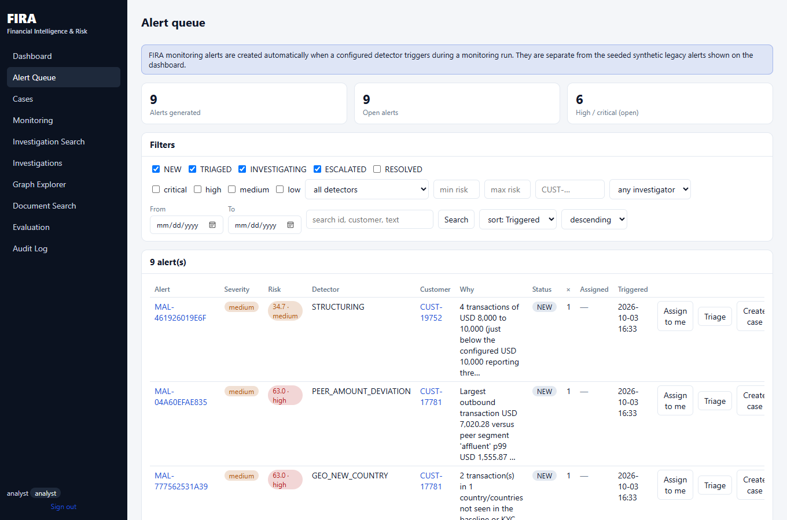

Use the filters: status, severity, detector, risk range, customer, assignee, dates, free-text search and sorting.
Notice CUST-19752's alert exists although the customer's score (34.7) is below the investigation threshold of 40:
STRUCTURING is a *standalone* detector. Its companions AMOUNT_DEVIATION and PEER_AMOUNT_DEVIATION fired too but are
*supporting* detectors, so they did **not** raise alerts (their customer is not flagged). That is the alert-tier policy in
action (see `docs/RISK_ENGINE.md`).

### 4. Open the alert

Click the STRUCTURING alert.

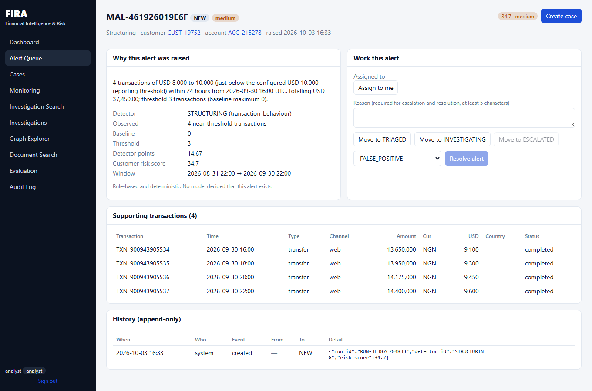

It shows the explanation ("4 transactions of USD 8,000 to 10,000 (just below the configured USD 10,000 reporting
threshold) within 24 hours … threshold 3 transactions (baseline maximum 0)"), observed value versus baseline and
threshold, the four supporting transactions, and the alert's append-only history (`created`). Everything on this page is
rule output: no model decided that this alert exists.

### 5. Create a case and open the workbench

Press **Create case**. Observed: case `FC-2026-000001`, status OPEN, priority medium, assigned to you; the alert moves
to INVESTIGATING.

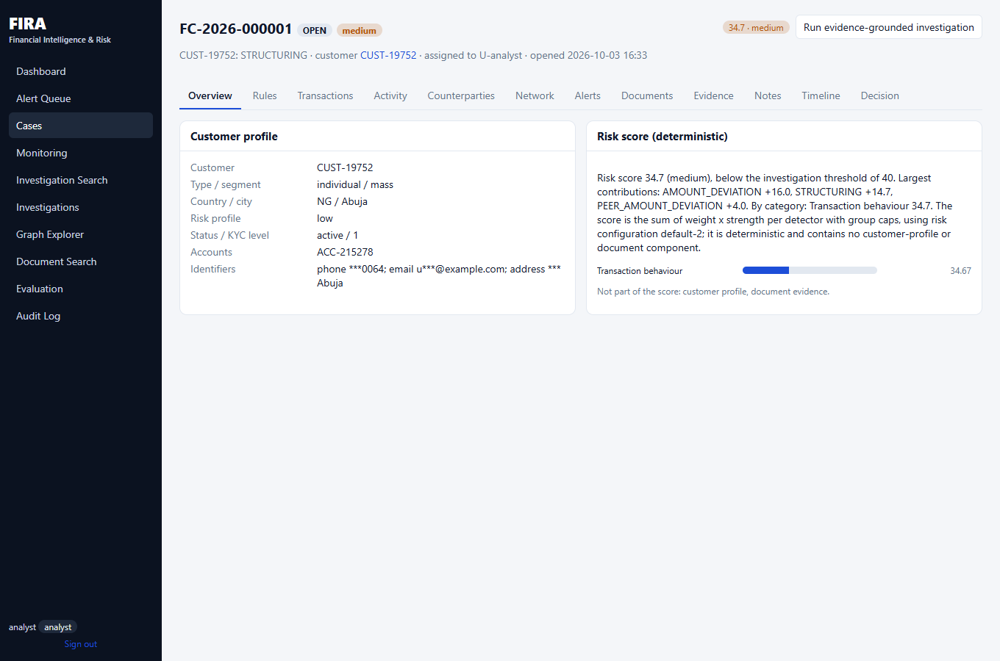

The workbench has twelve tabs. Overview: customer profile (identifiers masked) and the deterministic risk score with
its category breakdown (Transaction behaviour 34.67; AMOUNT_DEVIATION +16.0, STRUCTURING +14.7,
PEER_AMOUNT_DEVIATION +4.0). The panel says what is **not** in the score: customer profile and document evidence.

| Tab | What you see |
|---|---|
| Rules | triggered rules for the case and every detector's observed value and threshold 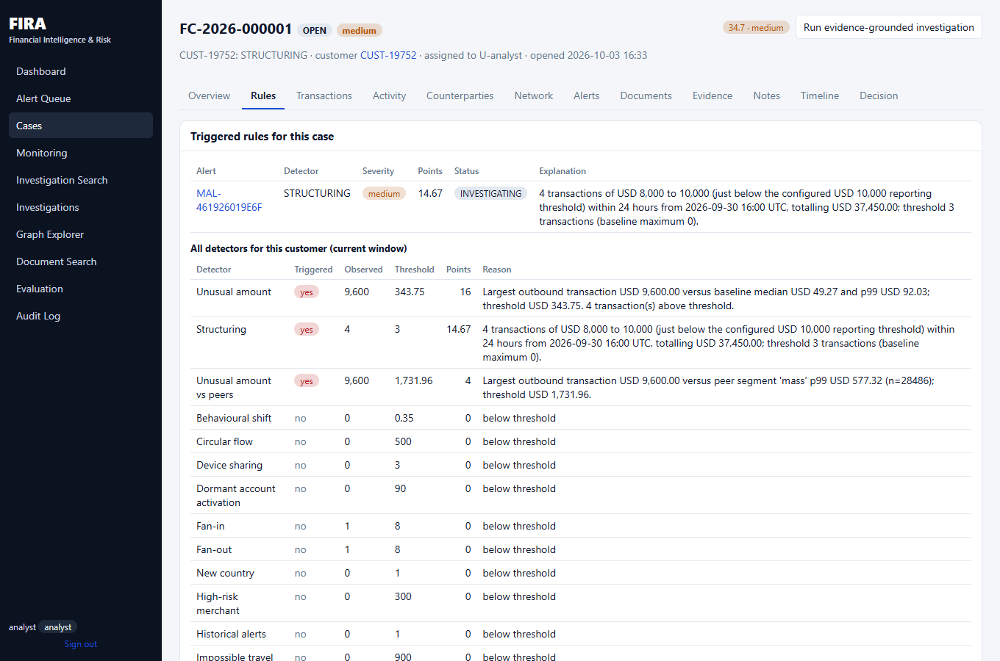 |
| Transactions | transactions that caused the alert, and the most recent 50 |
| Activity | 1 h / 24 h / 7 d / 30 d counts and value against the customer's baseline 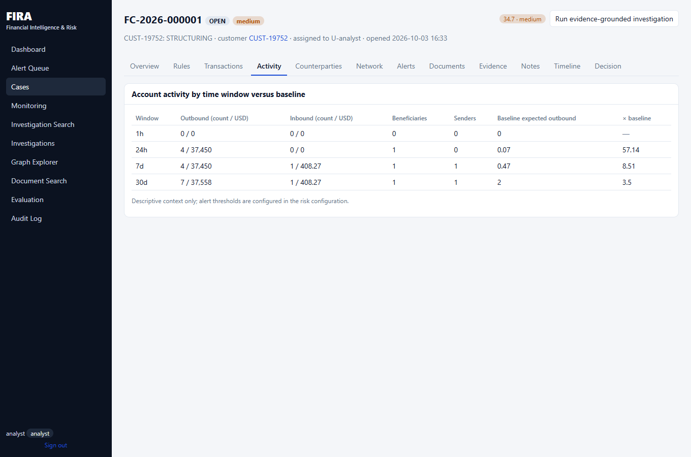 |
| Counterparties | direct and second-degree counterparties; beneficiaries also paid by other customers |
| Network | transaction network and cluster summary (reuses the Graph Explorer) 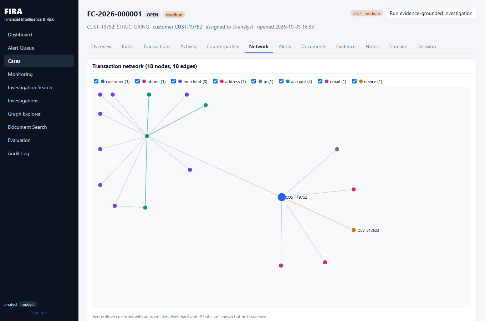 |
| Alerts | other FIRA alerts and the legacy seeded alerts for the customer |
| Documents | policy passages retrieved for the triggered detectors (fictional institution) |

### 6. Evidence and the evidence-grounded investigation

Press **Run evidence-grounded investigation** (a few seconds). The existing agent runs deterministically (no LLM is
configured), links the investigation to the case, and the **Evidence** tab fills with 19 items in this run, each tagged
with where it came from.

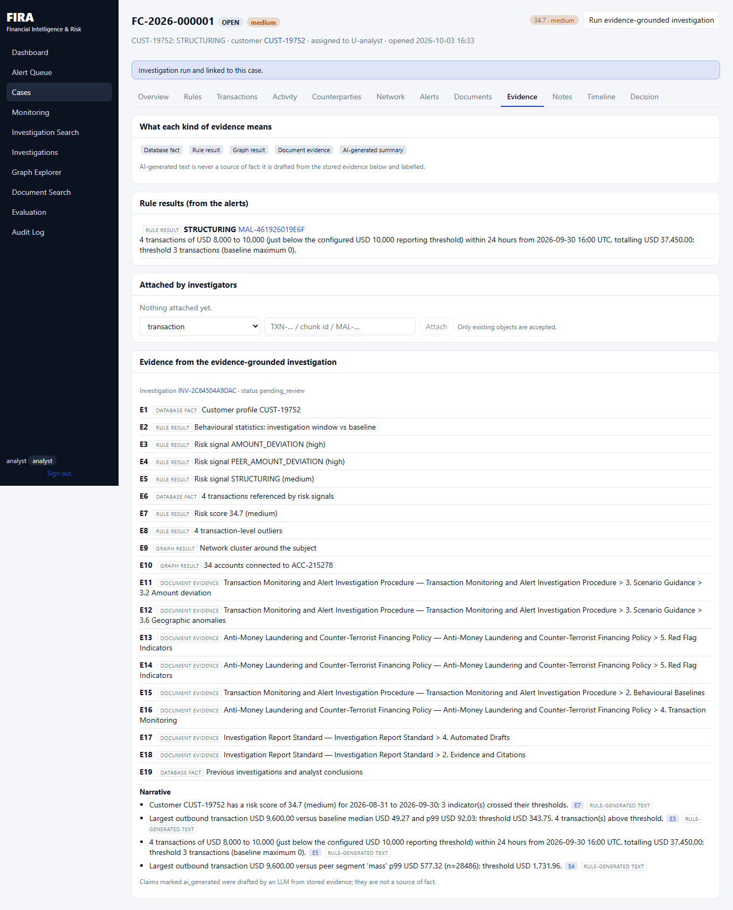

*Database fact* (profile, transactions, history), *Rule result* (detector output, risk score), *Graph result*,
*Document evidence*. The narrative below them is marked "rule-generated text"; with an LLM enabled, its claims would
be marked **AI-generated** and are never presented as a source of fact. You can also attach an existing transaction,
document passage or alert to the case; unknown ids are rejected.

### 7. Notes, status and decision

Notes tab: add a note (it cannot be edited or deleted). Decision tab: move the case to INVESTIGATING (a decision is
refused while the case is OPEN), choose a decision, write a reason (at least five characters, mandatory), and record it.

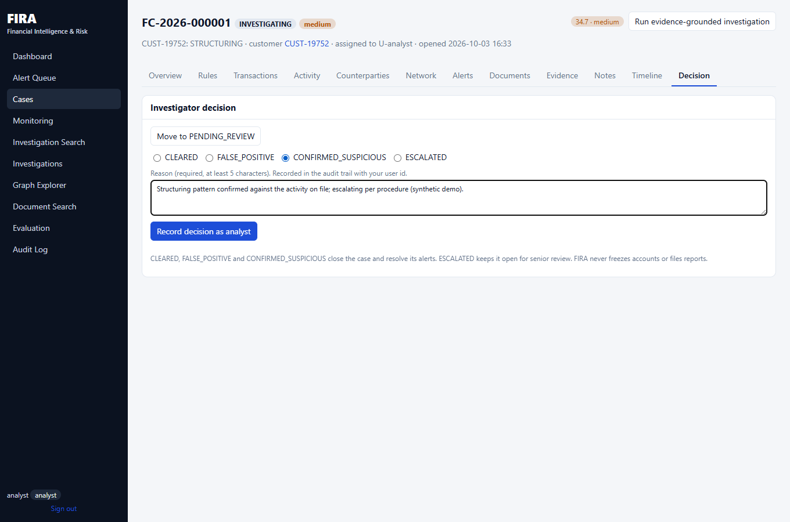

Observed: case CLOSED with `CONFIRMED_SUSPICIOUS`; the alert becomes RESOLVED with the same outcome; the linked
investigation is closed with the equivalent existing decision (`confirm`), so the two records agree. Other decisions:
CLEARED and FALSE_POSITIVE close the case; ESCALATED keeps it open (status ESCALATED). Another analyst cannot decide on
your case (403); an admin can.

### 8. Timeline and audit trail

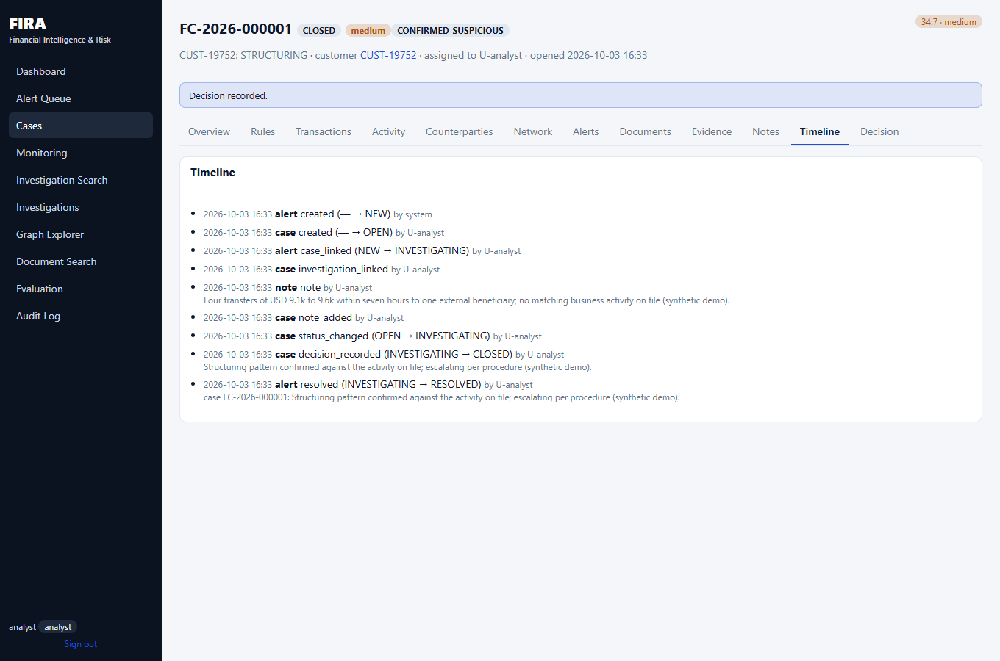

The case timeline merges case events, alert events and notes. Open **Audit Log** to see the same actions in the
database-backed audit trail, each with the user and request id:

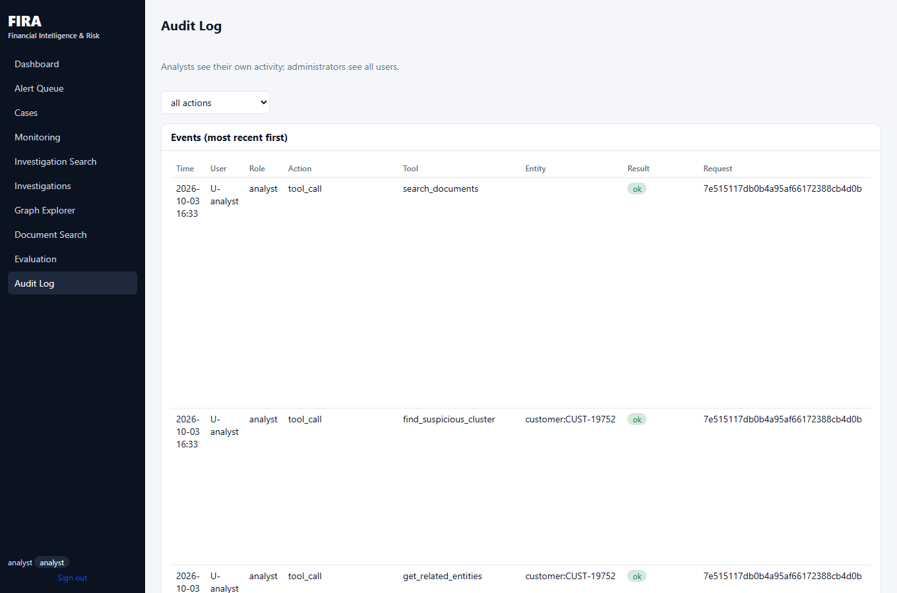

Observed audit actions for this flow: `alert_created`, `risk_score_generated`, `case_created`,
`alert_status_changed`, `case_status_changed`, `investigation_note_added`, `evidence_added`, `decision_recorded`,
`case_closed`, `agent_investigate`, `human_decision`. (In PostgreSQL mode the audit table and the history tables reject
update and delete at the database level; this is append-only enforcement, **not** cryptographic tamper-proofing.)

### 9. The dashboard reflects it

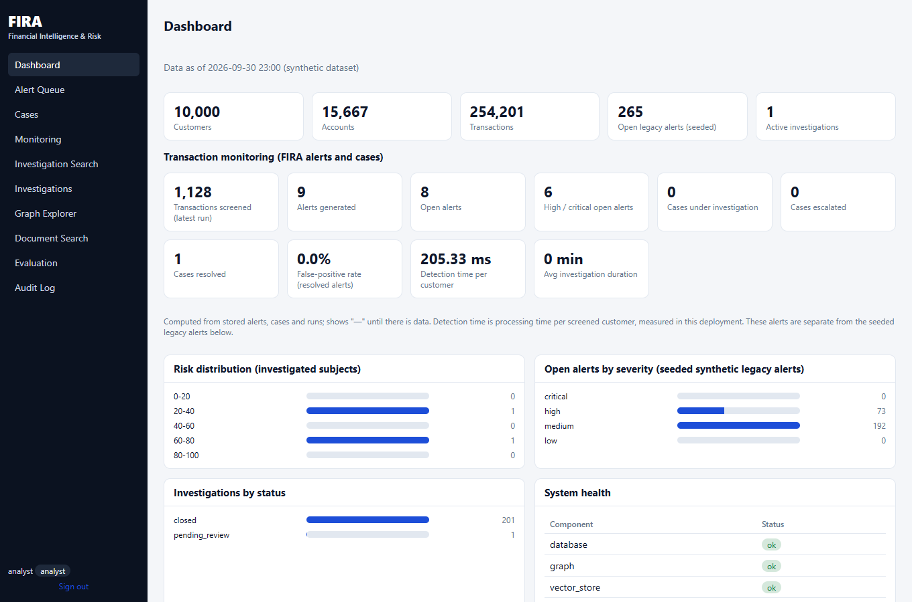

*Transaction monitoring* KPIs come from the stored alerts, cases and runs: alerts generated 9, open alerts 8, cases
resolved 1, false-positive rate 0.0% (one resolved alert, confirmed), detection time per customer in ms (measured in
this run, 217 ms in the observed run), average investigation duration (minutes in a demo). They show "—" when there is no
data.

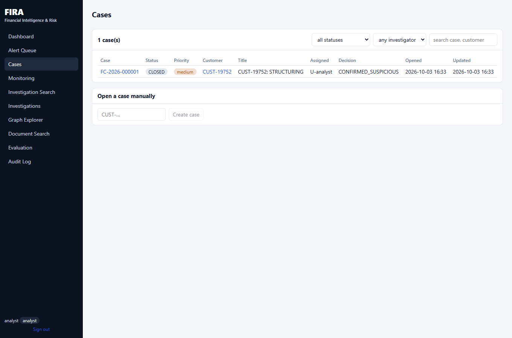

### 10. Evaluation

The same pipeline is measured against labelled synthetic benchmarks (`docs/EVALUATION.md`):

```powershell
python -m app.synthetic.monitoring_benchmark --out ..\data\benchmark --customers 4000 --seed 2025
python -m app.evaluation.monitoring_eval --dataset ..\data\benchmark --out ..\evaluation\results\monitoring_dev_seed2025
```

On the committed dev seed: precision 0.858, recall 0.865, false-positive rate 0.0049, PR-AUC 0.859, 20.1 alerts per
1,000 transactions. These describe a synthetic benchmark, not real-world performance.

## Part B. The same flow as a script

```powershell
python infrastructure\scripts\demo_api_walkthrough.py --url http://localhost:8000 `
  --admin-password $env:BOOTSTRAP_ADMIN_PASSWORD --analyst-password $env:BOOTSTRAP_ANALYST_PASSWORD --customer CUST-19752
```

Observed output (abridged, restart the API first so the case number is `FC-2026-000001`):

```
[1] Admin runs monitoring for CUST-19752        -> 0 created
[2] Admin ingests 4 new near-threshold transactions -> accepted 4; monitoring created 1 alert(s)
[3] Analyst opens the alert queue               -> MAL-… medium score 34.7 STRUCTURING: 4 transactions of USD 8,000 to 10,000 …
[4] Case FC-2026-000001 (OPEN, priority medium); investigation INV-… pending_review;
    workbench: risk 34.7 (medium); components [('Transaction behaviour', 34.67)]
[5] case CLOSED / CONFIRMED_SUSPICIOUS; alerts updated [MAL-…]; investigation {'status': 'closed', 'decision': 'confirm'}
[6] audit entries: alert_created, case_created, alert_status_changed, case_status_changed, investigation_note_added,
    evidence_added, decision_recorded, case_closed ... KPIs: alerts 1, open 0, cases {'CLOSED': 1}, false-positive rate 0.0
```

## Part C. The original single-subject investigation

The pre-existing workflow still works on its own: **Investigation Search → customer → Run investigation** produces
the evidence-grounded report with a human decision (`pending_review` → decision). With CUST-10686 and risk
configuration `default-2` the verified score is **67.4 (high)**: FAN_IN +18.0, FAN_OUT +13.1, VELOCITY_SPIKE +12.8,
GEO_NEW_COUNTRY +12.0, NETWORK_EXPOSURE +6.0, BEHAVIOURAL_SHIFT +5.4 (the FAN_OUT line is new in v2; the same customer
scored 54.2 under `default-1`). The mule scenario also expects RAPID_PASS_THROUGH, which does not fire for this
subject: the score is explainable, not perfect.

## Part D. The production-oriented scenarios (money mule, false positive, data-quality failure, recovery)

These use the **monitoring benchmark bank** because it contains a money-mule family and benign look-alikes. Customer ids differ from
Part A. Everything below was run end to end by `infrastructure/scripts/acceptance_test.py` (see [ACCEPTANCE_TEST.md](ACCEPTANCE_TEST.md));
the values quoted are from that run (1,500 customers, seed 31) and will differ on another seed.

```powershell
cd backend
python -m app.synthetic.monitoring_benchmark --out ..\data\demo_bank --customers 1500 --seed 31
$env:DATASET_DIR="..\data\demo_bank"        # then start PostgreSQL mode and bootstrap as in docs/DEPLOYMENT.md
```

1. **Data-quality failure.** Sign in as admin and send a batch with a duplicate id, a bad timestamp, a negative amount, an unknown account and
   an unknown field (`POST /api/monitoring/transactions`, with `"expected": {"count": 25}`). Observed: *19 received = 13 processed + 6 rejected*, six different
   reason codes, 1 late row, 6 missing. Open **Data Quality**: the totals, the reason bars and the **Rejected records** table show exactly which rows
   were quarantined and why (click *row* for the sanitised payload). Nothing was dropped silently.
2. **Triage.** Run monitoring for the scenario customers (Operations page, or `POST /api/monitoring/run`). Observed: 28 alerts: 4 CRITICAL, 18 HIGH, 6 MEDIUM.
   Open the **Alert Queue** (sorted by triage score by default), then an alert: the **Triage** card lists the 12 factors with points and one-line reasons
   and says it is a heuristic, not a probability.
3. **Money-mule scenario.** Open **Money-mule View**, pick the top suspect (observed `CUST-11490`: HIGH, 66.8): fan-in, fan-out, rapid movement, low
   retention and flagged-network indicators fired; the flow graph shows the inbound accounts, the forwarding and the amounts, times and direction.
   The banner says these are risk indicators, not proof.
4. **False-positive scenario.** Find a benign family-collection customer in the queue (it has a fan-in alert but a LOW mule band). Assign it to yourself,
   resolve it `FALSE_POSITIVE` with a reason. **Operations** now shows the confirmation and false-discovery rates (of *decided* alerts; with two decisions the page warns
   the sample is tiny) and says why no false-positive *rate* is shown.
5. **Case and decision.** Create a case from the mule alert, attach a transaction as evidence, add a note, change the priority (a reason is required), try to
   jump OPEN → PENDING_REVIEW (refused), start the investigation, record `CONFIRMED_SUSPICIOUS`. The case closes, its alert resolves, and the timeline is in time order.
6. **My Work.** The investigator dashboard lists open, high-priority, overdue and recently decided items.
7. **Governance.** As admin, switch a detector off with a reason, then on again (`POST /api/config/detectors/GEO_NEW_COUNTRY`). **Operations → Configuration changes**
   shows who changed what, old and new value, and why.
8. **Recovery.** `python infrastructure\scripts\pg_backup.py backup ...`, then `restore-test`, then `restore --target-db` and
   `verify_restored_app.py` ([DISASTER_RECOVERY.md](DISASTER_RECOVERY.md)). Observed on this machine: the restore step took about 21 s for a
   15,000-transaction database; the restored application reported ready with identical alert, case and batch counts.

## Things that can go wrong in a live demo

- Sign-in fails: the passwords are whatever you exported as `BOOTSTRAP_*_PASSWORD` in the shell that started the API
  (users are created on first start).
- Restarting the API in Frames mode clears alerts, cases, notes and the audit trail; run Part A step 1 again.
- Running monitoring for **all** customers takes minutes (about 0.1 s per customer, see `docs/PERFORMANCE.md`); keep demos
  to named customers or the CLI.
- The optional ML anomaly signal is absent unless you ran `python -m app.risk.ml train --sample 2000`.
- Without the Tesseract binary the scanned PDF memo is not indexed, so the chunk count differs from the Docker image.
- `FIRA_ENV=production` refuses to start without a 32+ character `JWT_SECRET`.
