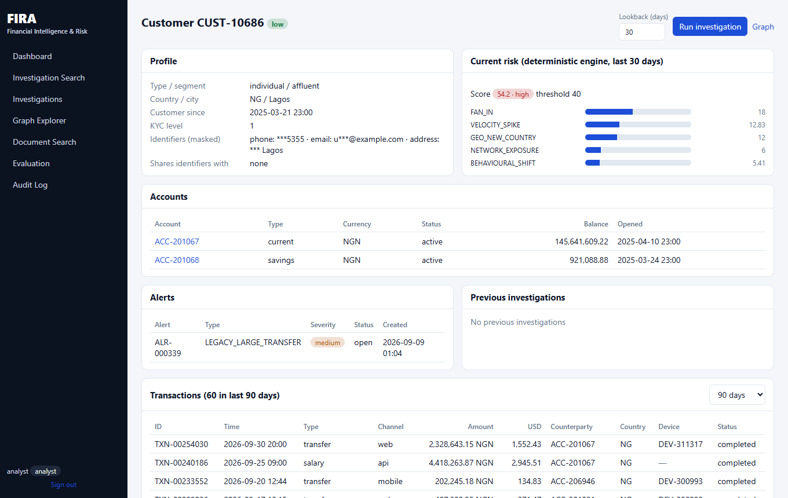

# Demo guide (about 10 minutes)

A walkthrough of one investigation, from search to human decision to audit trail. Everything below
uses the **synthetic** dataset. Nothing here is real customer data.

> **The customer IDs in this demo depend on the seed dataset.** They are valid for the default
> generator output (`--customers 10000`, default seed). If you regenerate with different parameters,
> find an equivalent subject in `data/seeds/scenario_labels.json` (scenario `mule_account`).

## Before you start

- Run the stack as described in the [README](../README.md#installation) and sign in as `analyst`
  with the password you set in `BOOTSTRAP_ANALYST_PASSWORD`.
- **Do not start from the first open alert on the dashboard.** Open alerts are *seeded synthetic
  legacy-rule alerts*, mostly noise by design. The first one in the list (CUST-14869 in the verified
  run) scores 0.0 / low in FIRA's own assessment, which makes a poor story. The alert queue exists so
  that investigations have a starting point, not as evidence of FIRA detecting anything.
- State mode matters. In **Frames mode** (the default for local demos) investigations, decisions and
  the audit trail live in memory and disappear when the API restarts. Use PostgreSQL mode if you want
  them to persist.

## Subject: CUST-10686

In the generator's ground truth this customer belongs to the `mule_account` scenario (many inbound
transfers from unrelated senders). The ground truth is read only by the evaluation module; the
investigation does not see it.

### 1. Dashboard

Open **Dashboard**. Note the synthetic data counts (10,000 customers, 15,667 accounts, 254,197
transactions), the 265 open seeded alerts, and the *System health* table: `indexed chunks` and
`source documents` are separate numbers (272 chunks from 12 registered documents: 11 files plus one
generated "historical case notes" document), the LLM provider is `none` and the agent engine is
`langgraph`. The chunk count (272) was measured **without** the Tesseract OCR binary installed, so the
scanned PDF memo contributed no chunks; with Tesseract installed (as in the Docker image) the number
is higher.

### 2. Investigation Search

Open **Investigation Search**, type `CUST-10686`, press **Search**, and open the result.

### 3. Customer profile

You land on the profile: profile fields, a "Current risk" card from the deterministic engine,
accounts, alerts and previous investigations. In the verified run the customer has one alert (seeded)
and no previous investigations. Transactions for the investigation window are shown inside the
investigation workspace (step 5).

### 4. Run the investigation
Press **Run investigation** (default lookback 30 days). The run takes a few seconds and ends in the
status `pending_review`. No account is changed and nothing is filed: the agent only prepares a
report for a human.

### 5. Risk assessment and signals
Verified result for this subject: **risk score 54.2, band high, 5 indicators fired**.

| Signal | Observed | Points |
|---|---|---|
| FAN_IN | 21 distinct counterparties sent funds in the window, against an expected 0.7 (threshold 8) | 18.0 |
| VELOCITY_SPIKE | 11 outbound transactions on 2026-09-10, against a baseline daily mean of 0.19 (threshold 6) | 12.83 |
| GEO_NEW_COUNTRY | 4 transactions in 3 countries not seen in the baseline or home country (AE, GH, US) | 12.0 |
| NETWORK_EXPOSURE | counterparties with open alerts | 6.0 |
| BEHAVIOURAL_SHIFT | change in activity mix versus baseline | 5.41 |

Open the **Risk Signals** tab to see each signal with its observed value, baseline, threshold and the
transaction IDs behind it.

Worth pointing out honestly: the `mule_account` scenario also expects RAPID_PASS_THROUGH, which did
**not** fire for this subject. The score is explainable, not perfect.

### 6. Evidence references
Every claim in the report carries references such as `E3`. Click one to jump to the **Evidence** tab,
which shows the stored evidence item (source type, content, confidence). In the verified run the
investigation stored 26 evidence items drawn from five source types: database, metric, graph,
history and document.

### 7. Graph
The **Graph** tab of the investigation and the standalone **Graph Explorer** show the customer's
neighbourhood. For `customer CUST-10686` at depth 2 the explorer showed 53 nodes and 59 edges
(merchants, accounts, devices, IPs and masked identifiers). The report's relationship section states
that the subject's network cluster contains 59 customers, 3 of which have open alerts, and no shared
devices.

### 8. Supporting documents
The **Documents** tab lists policy passages retrieved for the fired signals, for example the "Money
Mule and Network Typologies Guidance". Then open **Document Search** and try *who may file a
suspicious transaction report*. The hybrid mode combines keyword (BM25) and semantic (LSA) results.
All documents belong to a fictional institution ("Lagoon Bank Plc").

### 9. Human decision
Back on the **Report** tab, choose a decision, enter a rationale, and press **Record decision**. The
decision is stored with the investigation and linked to the agent run. Whether the investigation's
status then changes depends on the decision; in the verified run an `escalate` decision was recorded
and the status stayed `pending_review`.

### 10. Audit log

Open **Audit Log**. The trail shows the login, each tool call the agent made, and the
`human_decision` entry, all with request IDs. In PostgreSQL mode these rows are protected from
`UPDATE`/`DELETE`/`TRUNCATE` by database triggers (see [SECURITY.md](SECURITY.md)); in Frames mode
the trail is in memory.

## Other verified subjects

| Customer | Scenario | Verified result |
|---|---|---|
| CUST-17781 | circular_transfer | score 63.0 (high); circular flow ACC-203197 → ACC-212213 → ACC-204843 → ACC-203197 |
| CUST-16761 | device_sharing_ring | present in the ground truth; not walked through in this guide |

## Things that can go wrong in a live demo

- Sign-in fails: the analyst password is whatever you exported as `BOOTSTRAP_ANALYST_PASSWORD` in the
  shell that started the API. Users are created on first start only.
- The optional ML anomaly signal is absent unless you ran `make train-ml` (or the PowerShell
  equivalent in the README). The score above was produced without it.
- Restarting the API in Frames mode clears investigations, decisions and the audit trail.
- The first open alert may score 0 (see above).
